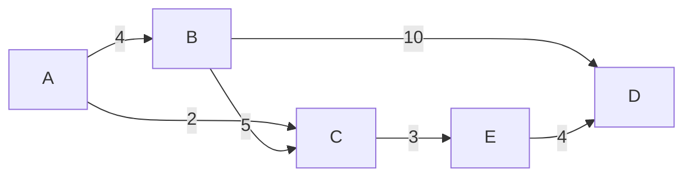

# GraphToolkit

> **Комплексная библиотека графовых алгоритмов для .NET 10+**

[](https://opensource.org/licenses/MIT)
[](https://dotnet.microsoft.com/)
[
[]()
[]()

GraphToolkit — это production-ready библиотека с **40+ классическими и продвинутыми алгоритмами на графах** в одном пакете. От базовых обходов до сложных задач вроде потока минимальной стоимости, Blossom-паросочетаний и раскраски графов.

---

## Содержание

- [Возможности](#возможности)
- [Установка](#установка)
- [Быстрый старт](#быстрый-старт)
- [Обзор API](#обзор-api)
  - [Создание графа](#создание-графа)
  - [Обходы](#обходы)
  - [Кратчайшие пути](#кратчайшие-пути)
  - [Минимальные остовные деревья](#минимальные-остовные-деревья)
  - [Компоненты связности](#компоненты-связности)
  - [Потоки в сети](#потоки-в-сети)
  - [Поток минимальной стоимости](#поток-минимальной-стоимости)
  - [Разрезы](#разрезы)
  - [Паросочетания](#паросочетания)
  - [Эйлеровы пути](#эйлеровы-пути)
  - [Гамильтоновы циклы и TSP](#гамильтоновы-циклы-и-tsp)
  - [Раскраска](#раскраска)
  - [Деревья](#деревья)
  - [Продвинутые алгоритмы на деревьях](#продвинутые-алгоритмы-на-деревьях)
  - [Деревья отрезков и Fenwick](#деревья-отрезков-и-fenwick)
  - [Транзитивное замыкание](#транзитивное-замыкание)
  - [Визуализация](#визуализация)
  - [Преобразования и альтернативные представления](#преобразования-и-альтернативные-представления)
- [Полная таблица алгоритмов](#полная-таблица-алгоритмов)
- [Архитектура](#архитектура)
- [Производительность](#производительность)
- [Сборка из исходников](#сборка-из-исходников)
- [Документация](#документация)
- [Лицензия](#лицензия)

---

## Возможности

**GraphToolkit** — это production-ready библиотека графовых алгоритмов
для .NET, покрывающая весь классический курс теории графов: от базовых
обходов до продвинутых задач (min-cost flow, все пары min-cut,
Link-Cut Tree, оптимальное назначение). Zero-dependency, полностью
документирована и снабжена юнит-тестами.

- ✅ **60+ алгоритмов** — от BFS и Дейкстры до Гомори-Ху, Диница, Blossom, Link-Cut Tree и Гомори-Ху
- ✅ **Универсальность** — generic `Graph<T>` для любого типа вершин (`int`, `string`, `record`, …)
- ✅ **Ориентированные и неориентированные** графы
- ✅ **Взвешенные и невзвешенные** рёбра
- ✅ **Две реализации графа** — `Graph<T>` (список смежности) и `AdjacencyMatrixGraph<T>` (матрица)
- ✅ **Fluent-билдер** для лаконичного создания графов
- ✅ **Структуры данных** — Segment Tree (с lazy propagation) и Fenwick Tree
- ✅ **Продвинутые алгоритмы на деревьях** — Centroid Decomposition, HLD, HldPathQueries, Link-Cut Tree
- ✅ **Min-cost flow** — SPFA и Дейкстра с потенциалами (Джонсон)
- ✅ **Все пары min-cut** — алгоритм Гомори-Ху поверх max-flow
- ✅ **Zero-dependency** — только BCL, никаких сторонних пакетов
- ✅ **Nullable-aware** — полная поддержка NRT (`<Nullable>enable</Nullable>`)
- ✅ **Визуализация** — экспорт в Mermaid и GraphViz DOT
- ✅ **Полная XML-документация** — интеграция с DocFX
- ✅ **256 юнит-тестов** — покрытие всех модулей
- ✅ **.NET 10** — использует `PriorityQueue`, `record`, `HashCode.Combine`

### Разделы возможностей

| Область | Что входит |
|---|---|
| **Обходы и порядок** | BFS, DFS, топологическая сортировка |
| **Кратчайшие пути** | Дейкстра, Беллман-Форд, A*, Флойд-Уоршелл, критический путь |
| **Остовные деревья** | Краскал, Прим, Борувка |
| **Компоненты** | Связные компоненты, SCC (Косараю), мосты, точки сочленения |
| **Потоки** | Форд-Фалкерсон, Эдмондс-Карп, Диниц, min-cut |
| **Min-cost flow** | SPFA, Дейкстра с потенциалами |
| **Разрезы** | Штёр-Вагнер (глобальный), Гомори-Ху (все пары) |
| **Паросочетания** | Куна, Blossom, Венгерский (назначения) |
| **Эйлеровы пути** | Проверка + алгоритм Хиерхольцера |
| **Гамильтоновы / TSP** | Backtracking, ветви и границы, ближайший сосед + 2-opt |
| **Раскраска** | Жадная (Уэлш-Пауэлл), точная (DSATUR), двудольность |
| **Деревья** | LCA, диаметр, центроид, Centroid Decomposition, HLD, Link-Cut Tree |
| **Структуры данных** | Segment Tree (с lazy), Fenwick Tree |
| **Замыкания** | Транзитивное замыкание и сокращение |
| **Преобразования** | Клонирование, транспонирование, смена направленности |
| **Визуализация** | DOT, Mermaid, матрица/список смежности |

---

## Установка

### NuGet

```bash
dotnet add package GraphToolkit
```

### Package Manager

```powershell
Install-Package GraphToolkit
```

### Из исходников

```bash
git clone https://github.com/example/GraphToolkit.git
cd GraphToolkit
dotnet build src/GraphToolkit/GraphToolkit.csproj -c Release
```

---

## Быстрый старт

### Создание графа и поиск пути

```csharp
using GraphToolkit.Utils;
using GraphToolkit.ShortestPaths;

// Fluent-билдер
var graph = new GraphBuilder<string>(isDirected: true)
    .AddEdge("A", "B", 4)
    .AddEdge("A", "C", 2)
    .AddEdge("B", "C", 5)
    .AddEdge("B", "D", 10)
    .AddEdge("C", "E", 3)
    .AddEdge("E", "D", 4)
    .Build();

// Кратчайший путь (Дейкстра)
var path = Dijkstra.FindPath(graph, "A", "D");
Console.WriteLine(string.Join(" -> ", path));
// A -> C -> E -> D
```

### Минимальное остовное дерево

```csharp
using GraphToolkit.MinimumSpanningTree;

var graph = new GraphBuilder<string>(isDirected: false)
    .AddEdge("A", "B", 1)
    .AddEdge("B", "C", 2)
    .AddEdge("A", "C", 3)
    .AddEdge("C", "D", 4)
    .Build();

foreach (var edge in Kruskal.Compute(graph))
    Console.WriteLine(edge);
// A -> B (1)
// B -> C (2)
// C -> D (4)
```

### Максимальный поток

```csharp
using GraphToolkit.Core;
using GraphToolkit.Flow;

var net = new FlowNetwork<string>();
net.AddEdge("S", "A", 16);
net.AddEdge("S", "B", 13);
net.AddEdge("A", "B", 10);
net.AddEdge("A", "C", 12);
net.AddEdge("B", "D", 14);
net.AddEdge("C", "B", 9);
net.AddEdge("C", "T", 20);
net.AddEdge("D", "C", 7);
net.AddEdge("D", "T", 4);

double maxFlow = Dinic.Compute(net, "S", "T");
Console.WriteLine($"Max flow: {maxFlow}");
// Max flow: 23
```

### Визуализация

```csharp
using GraphToolkit.Visualization;

string mermaid = GraphExporters.ToMermaid(graph);
Console.WriteLine(mermaid);
```

Результат:



---

## Обзор API

### Создание графа

Три способа создать граф:

```csharp
// 1. Напрямую через конструктор
using GraphToolkit.Core;

var graph = new Graph<string>(isDirected: true);
graph.AddEdge("A", "B", 4);
graph.AddEdge("B", "C", 2);

// 2. Через fluent-билдер
var graph2 = new GraphBuilder<int>(isDirected: false)
    .AddEdge(1, 2, 1.5)
    .AddEdge(2, 3, 2.5)
    .AddVertex(4)  // изолированная вершина
    .Build();

// 3. Через интерфейс IGraph<T> — своя реализация
IGraph<MyVertex> custom = new MyCustomGraph();
```

### Обходы

```csharp
using GraphToolkit.Traversal;

// BFS — кратчайший путь по рёбрам
var path = Bfs.FindPath(graph, "A", "F");

// DFS — любой путь
var path2 = Dfs.FindPath(graph, "A", "F");

// Топологическая сортировка DAG
var order = TopologicalSort.Sort(dag);

// Уровни в DAG
var levels = TopologicalSort.ComputeLevels(dag);
```

### Кратчайшие пути

```csharp
using GraphToolkit.ShortestPaths;

// Дейкстра — неотрицательные веса
var (dist, prev) = Dijkstra.Compute(graph, "A");
var path = Dijkstra.FindPath(graph, "A", "F");

// Беллман-Форд — отрицательные веса + детекция циклов
var (dist2, prev2, hasNegCycle) = BellmanFord.Compute(graph, "A");

// A* — эвристический поиск
var path2 = AStar.FindPath(graph, "A", "F",
    (a, b) => ManhattanDistance(coords[a], coords[b]));

// Флойд-Уоршелл — все пары
var (distMatrix, nextMatrix, vertices) = FloydWarshall.Compute(graph);
```

### Минимальные остовные деревья

```csharp
using GraphToolkit.MinimumSpanningTree;

// Краскал — O(E log E), разреженные графы
var mst = Kruskal.Compute(graph);

// Прим — O((V+E) log V), плотные графы
var mst2 = Prim.Compute(graph, startVertex: "A");

// Борувка — O(E log V), параллелизуется
var mst3 = Boruvka.Compute(graph);
```

### Компоненты связности

```csharp
using GraphToolkit.Components;

// Связные компоненты (неориентированный)
var components = ConnectedComponents.Find(graph);

// Сильная связность (Косараю)
var sccs = StronglyConnectedComponents.Find(directedGraph);

// Мосты и точки сочленения (Тарьян)
var result = BridgesAndArticulation.Find(graph);
Console.WriteLine($"Мосты: {result.Bridges.Count}");
Console.WriteLine($"Точки сочленения: {result.ArticulationPoints.Count}");
```

### Потоки в сети

```csharp
using GraphToolkit.Core;
using GraphToolkit.Flow;

var net = new FlowNetwork<string>();
net.AddEdge("S", "A", 16);
net.AddEdge("A", "T", 10);
// ...

// Диниц — самый быстрый, O(V²E)
double maxFlow = Dinic.Compute(net, "S", "T");

// Эдмондс-Карп — O(VE²)
double maxFlow2 = EdmondsKarp.Compute(net, "S", "T");

// Форд-Фалкерсон — O(E·f)
double maxFlow3 = FordFulkerson.Compute(net, "S", "T");

// Минимальный разрез (после max-flow)
var sourceSide = Dinic.MinCut(net, "S", "T");
```

### Поток минимальной стоимости

```csharp
using GraphToolkit.Core;
using GraphToolkit.Flow;

var net = new CostFlowNetwork<string>();
net.AddEdge("S", "A", capacity: 4, cost: 2);
net.AddEdge("S", "B", capacity: 3, cost: 1);
net.AddEdge("A", "B", capacity: 1, cost: 1);
net.AddEdge("A", "T", capacity: 3, cost: 3);
net.AddEdge("B", "T", capacity: 4, cost: 2);

// Дейкстра с потенциалами — быстрее
var (flow, cost) = MinCostFlow.DijkstraWithPotentials(net, "S", "T");

// SPFA — работает с отрицательными стоимостями
var (flow2, cost2) = MinCostFlow.Spfa(net, "S", "T");
```

### Разрезы

```csharp
using GraphToolkit.Cut;

// Глобальный минимальный разрез (Штёр-Вагнер)
var result = StoerWagner.Compute(undirectedGraph);
Console.WriteLine($"Min-cut: {result.MinCut}");
Console.WriteLine($"Partition A: {string.Join(",", result.PartitionA)}");
Console.WriteLine($"Partition B: {string.Join(",", result.PartitionB)}");
// Все пары min-cut (Гомори-Ху) — O(V · MaxFlow)
var gomoryTree = GomoryHu.Compute(undirectedGraph);
Console.WriteLine(gomoryTree.MinCut("A", "C"));
```

### Паросочетания

```csharp
using GraphToolkit.Matching;

// Куна — двудольный граф
var matching = Kuhn.Compute(
    left: new[] { "A", "B", "C" },
    neighbors: u => adjacency[u]);

// Blossom — общий граф (Эдмондс)
var matching2 = Blossom.Compute(generalGraph);
bool perfect = Blossom.HasPerfectMatching(generalGraph);
```

### Эйлеровы пути

```csharp
using GraphToolkit.Eulerian;

bool hasCycle = EulerianPath.HasCycle(graph);
bool hasPath = EulerianPath.HasPath(graph, out var start, out var end);

var path = EulerianPath.Find(graph);
Console.WriteLine(string.Join(" -> ", path));
```

### Гамильтоновы циклы и TSP

```csharp
using GraphToolkit.Hamiltonian;

// Гамильтонов цикл (перебор)
var cycle = HamiltonianCycle.FindCycle(graph);
var hpath = HamiltonianCycle.FindPath(graph);

// TSP — точное решение (ветви и границы)
var exact = Tsp.BranchAndBound(tspGraph, "A");
Console.WriteLine($"Оптимум: {exact.Cost}");

// TSP — приближённое решение (ближайший сосед + 2-opt)
var approx = Tsp.NearestNeighbor(tspGraph, "A");
Console.WriteLine($"Приближённо: {approx.Cost}");
```

### Раскраска

```csharp
using GraphToolkit.Coloring;

// Жадная (Уэлш-Пауэлл)
var colors = GraphColoring.Greedy(graph);

// Точная (DSATUR)
var (optimalColors, chromaticNumber) = GraphColoring.Exact(graph);
Console.WriteLine($"χ(G) = {chromaticNumber}");

// Проверка двудольности
bool isBipartite = GraphColoring.IsBipartite(graph, out var part);
```

### Деревья

```csharp
using GraphToolkit.Trees;

// LCA — наименьший общий предок
var lca = new Lca<string>(tree, root: "A");
var ancestor = lca.Query("D", "G");

// Диаметр дерева
var diameter = TreeMetrics.Diameter(tree);
Console.WriteLine($"Диаметр: {diameter.Distance}");

// Центроид
var centroid = TreeMetrics.Centroid(tree);
```

### Продвинутые алгоритмы на деревьях

```csharp
using GraphToolkit.Trees;

// Центроидная декомпозиция — O(log V) на запрос расстояния
var cd = new CentroidDecomposition<int>(tree);
Console.WriteLine(cd.Distance(4, 7));

// Heavy-Light Decomposition — O(log V) на LCA и пути
var hld = new HeavyLightDecomposition<int>(tree, root: 1);
Console.WriteLine(hld.Lca(4, 7));
var path = hld.PathVertices(4, 7);

// HLD + запросы на путях через дерево отрезков
var pathQ = new HldPathQueries<int, long>(
    tree, root: 1,
    valueOf: v => weights[v],
    combine: (a, b) => a + b,
    identity: 0);
Console.WriteLine(pathQ.Query(4, 7));
pathQ.Update(4, 100);

// Link-Cut Tree — динамический лес
var lct = new LinkCutTree<int>();
lct.AddVertex(1); lct.AddVertex(2);
lct.SetValue(1, 10); lct.SetValue(2, 20);
lct.Link(1, 2);
Console.WriteLine(lct.PathSum(1, 2));   // 30
lct.Cut(1, 2);
```

### Деревья отрезков и Fenwick

```csharp
using GraphToolkit.Structures;

// Segment Tree — запросы min/max/sum + range update
var st = new SegmentTree<long>(
    values: new long[] { 1, 2, 3, 4, 5 },
    combine: (a, b) => a + b,
    identity: 0);

Console.WriteLine(st.Query(1, 4));   // 9
st.Update(2, 10);
Console.WriteLine(st.Query(0, 5));   // 22

// Fenwick — быстрее для сумм
var bit = new FenwickTree<long>(
    values: new long[] { 1, 2, 3, 4, 5 },
    add: (a, b) => a + b,
    identity: 0,
    subtract: (a, b) => a - b);

Console.WriteLine(bit.RangeAggregate(1, 4));   // 9
bit.Add(2, 10);
Console.WriteLine(bit.RangeAggregate(1, 4));   // 19
```

### Транзитивное замыкание

```csharp
using GraphToolkit.Closure;

// Матрица достижимости
bool[,] reach = TransitiveClosure.Compute(graph);

// Словарь достижимости
var reachDict = TransitiveClosure.ComputeDict(graph);

// Транзитивное сокращение (DAG)
var reduced = TransitiveClosure.Reduce(dag);
```

### Визуализация

```csharp
using GraphToolkit.Visualization;

// Mermaid — для markdown
string mermaid = GraphExporters.ToMermaid(graph);

// GraphViz DOT
string dot = GraphExporters.ToDot(graph, "MyGraph");

// Матрица смежности
string matrix = GraphExporters.ToAdjacencyMatrix(graph);

// Список смежности
string list = GraphExporters.ToAdjacencyList(graph);
```

### Преобразования и альтернативные представления

```csharp
using GraphToolkit.Core;

// Клонирование
var copy = graph.Clone();

// Смена направленности
var undirected = directedGraph.ToUndirected();
var directed = undirectedGraph.ToDirected();
var transposed = graph.Transpose();

// Матрица смежности (для плотных графов)
var matrix = new AdjacencyMatrixGraph<string>(isDirected: true);
matrix.AddEdge("A", "B", 4);
// Работает с любым алгоритмом GraphToolkit

// Задача о назначениях (Венгерский алгоритм)
using GraphToolkit.Matching;
var assignment = HungarianAlgorithm.Solve(costMatrix);
Console.WriteLine($"Минимальная стоимость: {assignment.TotalCost}");

---

## Полная таблица алгоритмов

| Категория | Алгоритм — что решает | Сложность | Файл |
|---|---|---|---|
| **Обходы** | BFS — обход в ширину | O(V + E) | `Traversal/Bfs.cs` |
| | DFS — обход в глубину | O(V + E) | `Traversal/Dfs.cs` |
| | Топологическая сортировка (Кана) | O(V + E) | `Traversal/TopologicalSort.cs` |
| **Кратчайшие пути** | Дейкстра — от одного источника | O((V+E) log V) | `ShortestPaths/Dijkstra.cs` |
| | Беллман-Форд — с отрицательными весами | O(V · E) | `ShortestPaths/BellmanFord.cs` |
| | A* — эвристический поиск | Зависит от эвристики | `ShortestPaths/AStar.cs` |
| | Флойд-Уоршелл — все пары | O(V³) | `ShortestPaths/FloydWarshall.cs` |
| | Критический путь — самый длинный в DAG | O(V + E) | `ShortestPaths/CriticalPath.cs` |
| **MST** | Краскал — разреженные графы | O(E log E) | `MinimumSpanningTree/Kruskal.cs` |
| | Прим — плотные графы | O((V+E) log V) | `MinimumSpanningTree/Prim.cs` |
| | Борувка — параллелизуемый | O(E log V) | `MinimumSpanningTree/Boruvka.cs` |
| **Компоненты** | Связные компоненты | O(V + E) | `Components/ConnectedComponents.cs` |
| | SCC (Косараю) — сильная связность | O(V + E) | `Components/StronglyConnectedComponents.cs` |
| | Мосты и точки сочленения (Тарьян) | O(V + E) | `Components/BridgesAndArticulation.cs` |
| **Потоки** | Форд-Фалкерсон — классика | O(E · f) | `Flow/FordFulkerson.cs` |
| | Эдмондс-Карп — BFS-версия | O(V · E²) | `Flow/EdmondsKarp.cs` |
| | Диниц — быстрейший из классических | O(V² · E) | `Flow/Dinic.cs` |
| **Min-cost flow** | SPFA — с отрицательными стоимостями | O(V · E · F) | `Flow/MinCostFlow.cs` |
| | Дейкстра с потенциалами (Джонсон) | O(F · E · log V) | `Flow/MinCostFlow.cs` |
| **Разрезы** | Штёр-Вагнер — глобальный min-cut | O(V³) | `Cut/StoerWagner.cs` |
| | Гомори-Ху — все пары min-cut | O(V · MaxFlow) | `Cut/GomoryHu.cs` |
| **Паросочетания** | Куна — макс. паросочетание (двудольный) | O(V · E) | `Matching/Kuhn.cs` |
| | Blossom / Эдмондс — макс. паросочетание (общий) | O(V³) | `Matching/Blossom.cs` |
| | Венгерский — оптимальное назначение | O(V³) | `Matching/HungarianAlgorithm.cs` |
| **Эйлеровы** | Проверка + Хиерхольцер — эйлеров путь | O(V + E) | `Eulerian/EulerianPath.cs` |
| **Гамильтоновы** | Цикл / путь — перебор с возвратом | O(V!) | `Hamiltonian/HamiltonianCycle.cs` |
| | TSP — ветви и границы (точный) | O(V² · 2^V) | `Hamiltonian/Tsp.cs` |
| | TSP — ближайший сосед + 2-opt | O(V²) | `Hamiltonian/Tsp.cs` |
| **Раскраска** | Жадная (Уэлш-Пауэлл) | O(V² + E) | `Coloring/GraphColoring.cs` |
| | Точная (DSATUR) | экспоненциальная | `Coloring/GraphColoring.cs` |
| | Проверка двудольности | O(V + E) | `Coloring/GraphColoring.cs` |
| **Деревья** | LCA — наименьший общий предок | O(V log V) + O(log V) | `Trees/Lca.cs` |
| | Диаметр дерева | O(V log V) | `Trees/TreeMetrics.cs` |
| | Центроид дерева | O(V) | `Trees/TreeMetrics.cs` |
| | **Центроидная декомпозиция** | O(V log V) + O(log V) запрос | `Trees/CentroidDecomposition.cs` |
| | **Heavy-Light Decomposition** | O(V) + O(log V) запрос | `Trees/HeavyLightDecomposition.cs` |
| | **HLD + запросы на путях** | O(V) + O(log² V) запрос | `Trees/HldPathQueries.cs` |
| | **Link-Cut Tree** | O(log V) амортиз. | `Trees/LinkCutTree.cs` |
| **Структуры** | Segment Tree — запросы на отрезках | O(log n) | `Structures/SegmentTree.cs` |
| | Fenwick Tree — префиксные суммы | O(log n) | `Structures/FenwickTree.cs` |
| **Замыкания** | Транзитивное замыкание | O(V³) | `Closure/TransitiveClosure.cs` |
| | Транзитивное сокращение (DAG) | O(V³) | `Closure/TransitiveClosure.cs` |
| **Преобразования** | Клонирование графа | O(V + E) | `Core/Graph.cs` |
| | Транспонирование | O(V + E) | `Core/Graph.cs` |
| | Смена направленности (`ToUndirected` / `ToDirected`) | O(V + E) | `Core/Graph.cs` |
| | Клонирование сети (`FlowNetwork<T>.Clone`) | O(V + E) | `Core/FlowNetwork.cs` |
| | Клонирование сети (`CostFlowNetwork<T>.Clone`) | O(V + E) | `Core/CostFlowNetwork.cs` |
| **Представления** | Матрица смежности `AdjacencyMatrixGraph<T>` | O(V²) памяти | `Core/AdjacencyMatrixGraph.cs` |
| **Визуализация** | DOT / Mermaid / матрица / список | — | `Visualization/GraphExporters.cs` |

---

## Архитектура

```
GraphToolkit/
├── src/GraphToolkit/
│   ├── Core/                     # Базовые типы и структуры
│   │   ├── Edge.cs               # Ребро
│   │   ├── Graph.cs              # Основной граф (список смежности)
│   │   ├── AdjacencyMatrixGraph.cs # Граф на матрице смежности
│   │   ├── IGraph.cs             # Интерфейс графа
│   │   ├── FlowNetwork.cs        # Сеть для max-flow
│   │   ├── CostFlowNetwork.cs    # Сеть для min-cost flow
│   │   ├── Optional.cs           # Опциональное значение (для generic-кода)
│   │   └── UnionFind.cs          # Система непересекающихся множеств
│   ├── Traversal/                # BFS, DFS, топосорт
│   ├── ShortestPaths/            # Дейкстра, BF, A*, FW, критический путь
│   ├── MinimumSpanningTree/      # Краскал, Прим, Борувка
│   ├── Components/               # Связные, SCC, мосты, точки сочленения
│   ├── Flow/                     # Форд-Фалкерсон, Эдмондс-Карп, Диниц,
│   │                             # min-cost flow (SPFA, Дейкстра+потенциалы)
│   ├── Cut/                      # Штёр-Вагнер, Гомори-Ху
│   ├── Matching/                 # Куна, Blossom, Венгерский
│   ├── Eulerian/                 # Эйлеровы пути (проверка + Хиерхольцер)
│   ├── Hamiltonian/              # Гамильтоновы циклы, TSP
│   ├── Coloring/                 # Жадная, DSATUR, двудольность
│   ├── Trees/                    # LCA, диаметр, центроид,
│   │                             # центроидная декомпозиция, HLD,
│   │                             # HldPathQueries, Link-Cut Tree
│   ├── Structures/               # Segment Tree, Fenwick Tree
│   ├── Closure/                  # Транзитивное замыкание и сокращение
│   ├── Visualization/            # Экспорт в DOT/Mermaid
│   └── Utils/                    # GraphBuilder, расширения
├── tests/GraphToolkit.Tests/     # Юнит-тесты (~260 тестов)
├── docs/                         # DocFX-документация
├── samples/                      # Примеры (Routing, SocialNetwork,
│                                 # Scheduling, Transportation, Clustering)
├── build-docs.ps1                # Сборка документации (Windows)
├── build-docs.sh                 # Сборка документации (Linux/macOS)
├── .gitignore
├── .gitattributes
├── README.md
├── LICENSE
└── GraphToolkit.sln
```

### Принципы дизайна

1. **Интерфейс `IGraph<T>`** — все алгоритмы работают через абстракцию.
   Можно подставить `Graph<T>` (список смежности), `AdjacencyMatrixGraph<T>`
   (матрица) или собственную реализацию.

2. **Generic `T`** — никаких ограничений на тип вершины, только
   `where T : notnull`. Специальные структуры (`Dictionary<T, T>` без ключа
   = «нет значения») используются вместо `T?`, чтобы избежать проблем
   с nullable-типами под generic-ограничением.

3. **Nullable-aware** — `Nullable` включён на уровне проекта.

4. **Immutable results** — результаты возвращаются в виде `record` или
   `IReadOnlyList<T>` там, где это уместно.

5. **Один файл = один алгоритм** (за редким исключением, например
   `MinCostFlow.cs` содержит два алгоритма).

6. **Zero-dependency** — только BCL.

### Структура по уровням

- **`Core/`** — базовые типы, от которых зависят все алгоритмы.
  Не зависит ни от чего, кроме BCL.
- **`Structures/`** — вспомогательные структуры данных
  (`SegmentTree`, `FenwickTree`), не привязанные к графам.
- **Алгоритмы** (`Traversal`, `ShortestPaths`, `Flow`, `Trees` и т. д.) —
  зависят только от `Core/` и `Structures/`, но не друг от друга
  (за редким исключением вроде `HldPathQueries`, который использует
  `SegmentTree`).
- **`Visualization/`** и **`Utils/`** — утилитарные модули, могут
  зависеть от любого алгоритма.

---

## Производительность

Ориентировочные числа на .NET 10, Intel i7, случайные разреженные графы:

| Алгоритм | V = 10³ | V = 10⁴ | V = 10⁵ |
|---|---|---|---|
| BFS | < 1 мс | 5 мс | 60 мс |
| Дейкстра | < 1 мс | 15 мс | 200 мс |
| Краскал | < 1 мс | 20 мс | 300 мс |
| Диниц (V=500) | — | — | ~100 мс |
| SCC (Косараю) | < 1 мс | 10 мс | 120 мс |

> [!TIP]
> Для графов V > 10⁶ рассмотрите специализированные структуры
> (struct-based edges, `ArrayPool`, параллельные версии MST).

---

## Сборка из исходников

### Требования

- **.NET SDK 10.0+**
- **DocFX 2.75+** (опционально, для документации)

### Сборка

```bash
git clone https://github.com/TheGhost1K/GraphToolkit.git
cd GraphToolkit

# Сборка библиотеки
dotnet build src/GraphToolkit.csproj -c Release

# Тесты
dotnet test

# Пакет NuGet
dotnet pack src/GraphToolkit.csproj -c Release -o ./artifacts
```

### Сборка документации

```bash
# Windows
./build-docs.ps1 -Serve

# Linux/macOS
./build-docs.sh
```

Или вручную:

```bash
dotnet tool install -g docfx
cd docs
docfx metadata docfx.json
docfx build docfx.json
docfx serve _site
```

Сайт откроется на `http://localhost:8080`.

---

## Документация

Полная документация с примерами и API-справочником доступна на [GitHub Pages](https://TheGhost1K.github.io/GraphToolkit) (или разверните локально через DocFX).

### Разделы

- [Установка](docs/articles/installation.md)
- [Быстрый старт](docs/articles/getting-started.md)
- [Ключевые концепции](docs/articles/core-concepts.md)
- [Обходы графа](docs/articles/traversal.md)
- [Кратчайшие пути](docs/articles/shortest-paths.md)
- [MST](docs/articles/minimum-spanning-tree.md)
- [Компоненты связности](docs/articles/components.md)
- [Потоки в сети](docs/articles/flows.md)
- [Min-cost flow](docs/articles/min-cost-flow.md)
- [Паросочетания](docs/articles/matching.md)
- [TSP и гамильтоновы циклы](docs/articles/hamiltonian-tsp.md)
- [Раскраска](docs/articles/coloring.md)
- [Деревья](docs/articles/trees.md)
- [Визуализация](docs/articles/visualization.md)
- [Производительность](docs/articles/performance.md)

---

## Примеры использования

Смотрите папку [`samples/`](samples/) — там реальные примеры применения:

- `samples/Routing/` — маршрутизация в дорожной сети
- `samples/SocialNetwork/` — анализ социального графа
- `samples/Scheduling/` — планирование задач (топосорт)
- `samples/Transportation/` — транспортная задача (min-cost flow)
- `samples/Clustering/` — кластеризация через MST

---

## Вклад

Мы приветствуем вклад! Пожалуйста:

1. Форкните репозиторий
2. Создайте ветку (`git checkout -b feature/amazing-algorithm`)
3. Закоммитьте изменения (`git commit -am 'Add amazing algorithm'`)
4. Запушьте (`git push origin feature/amazing-algorithm`)
5. Откройте Pull Request

### Стандарты кода

- Nullable reference types **обязательны**
- XML-комментарии для **всех** публичных членов
- `TreatWarningsAsErrors` включён
- Юнит-тесты для новых алгоритмов
- Стиль — стандартный .NET (можно проверить `dotnet format`)

---

## Лицензия

Проект распространяется под лицензией **MIT**. См. файл [LICENSE](LICENSE).

```
MIT License

Copyright (c) 2026 GraphToolkit Contributors

Permission is hereby granted, free of charge, to any person obtaining a copy
of this software and associated documentation files (the "Software"), to deal
in the Software without restriction, including without limitation the rights
to use, copy, modify, merge, publish, distribute, sublicense, and/or sell
copies of the Software, and to permit persons to whom the Software is
furnished to do so, subject to the following conditions:

The above copyright notice and this permission notice shall be included in all
copies or substantial portions of the Software.

THE SOFTWARE IS PROVIDED "AS IS", WITHOUT WARRANTY OF ANY KIND, EXPRESS OR
IMPLIED, INCLUDING BUT NOT LIMITED TO THE WARRANTIES OF MERCHANTABILITY,
FITNESS FOR A PARTICULAR PURPOSE AND NONINFRINGEMENT. IN NO EVENT SHALL THE
AUTHORS OR COPYRIGHT HOLDERS BE LIABLE FOR ANY CLAIM, DAMAGES OR OTHER
LIABILITY, WHETHER IN AN ACTION OF CONTRACT, TORT OR OTHERWISE, ARISING FROM,
OUT OF OR IN CONNECTION WITH THE SOFTWARE OR THE USE OR OTHER DEALINGS IN THE
SOFTWARE.
```

---

## Благодарности

- Классические алгоритмы основаны на работах Дейкстры, Прима, Краскала,
  Форда-Фалкерсона, Эдмондса-Карпа, Диница, Тарьяна, Косараю, Штёра-Вагнера
- Вдохновлено библиотеками [QuikGraph](https://github.com/KeRNeLith/QuikGraph) и
  [NetworkX](https://networkx.org/)
- Сообществу .NET за отличную стандартную библиотеку

---

## Контакты

- 📖 [Документация](https://TheGhost1K.github.io/GraphToolkit)
- 🐛 [Issues](https://github.com/TheGhost1K/GraphToolkit/issues)
- 💬 [Discussions](https://github.com/TheGhost1K/GraphToolkit/discussions)

---

<div align="center">

**Если проект полезен — поставьте ⭐ на GitHub!**

Made with ❤️ by TheGhost1K

</div>