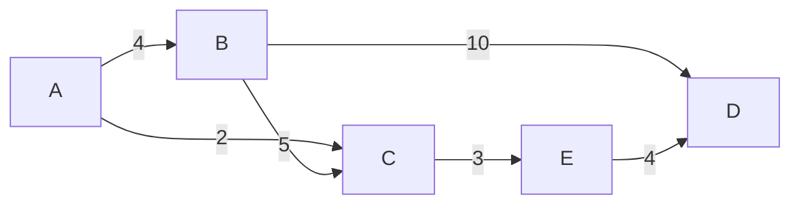

# GraphToolkit

> **Комплексная библиотека графовых алгоритмов для .NET 10+**

[](LICENSE)
[](https://dotnet.microsoft.com/)
[]()
[]()
[]()

GraphToolkit — это production-ready библиотека с **60+ графовыми алгоритмами** в одном пакете. Покрывает весь классический курс теории графов: от базовых обходов до продвинутых задач (min-cost flow, все пары min-cut, Link-Cut Tree, оптимальное назначение). Zero-dependency, полностью документирована и снабжена юнит-тестами.

---

## Содержание

- [Возможности](#возможности)
- [Установка](#установка)
- [CLI-утилита](#cli-утилита)
- [Быстрый старт](#быстрый-старт)
- [Обзор API](#обзор-api)
  - [Создание графа](#создание-графа)
  - [Обходы](#обходы)
  - [Кратчайшие пути](#кратчайшие-пути)
  - [Минимальные остовные деревья](#минимальные-остовные-деревья)
  - [Компоненты связности](#компоненты-связности)
  - [Потоки в сети](#потоки-в-сети)
  - [Поток минимальной стоимости](#поток-минимальной-стоимости)
  - [Разрезы](#разрезы)
  - [Паросочетания](#паросочетания)
  - [Эйлеровы пути](#эйлеровы-пути)
  - [Гамильтоновы циклы и TSP](#гамильтоновы-циклы-и-tsp)
  - [Раскраска](#раскраска)
  - [Деревья](#деревья)
  - [Продвинутые алгоритмы на деревьях](#продвинутые-алгоритмы-на-деревьях)
  - [Деревья отрезков и Fenwick](#деревья-отрезков-и-fenwick)
  - [Центральности](#центральности)
  - [Обнаружение сообществ](#обнаружение-сообществ)
  - [Работа с файлами](#работа-с-файлами)
  - [Транзитивное замыкание](#транзитивное-замыкание)
  - [Визуализация](#визуализация)
  - [Преобразования и альтернативные представления](#преобразования-и-альтернативные-представления)
  - [Продвинутые темы](#продвинутые-темы)
- [Полная таблица алгоритмов](#полная-таблица-алгоритмов)
- [Архитектура](#архитектура)
- [Производительность](#производительность)
- [Сборка из исходников](#сборка-из-исходников)
- [Документация](#документация)
- [Примеры использования](#примеры-использования)
- [Вклад](#вклад)
- [Лицензия](#лицензия)
- [Благодарности](#благодарности)
- [Контакты](#контакты)

---

## Возможности

**GraphToolkit** — это production-ready библиотека графовых алгоритмов для .NET, покрывающая весь классический курс теории графов: от базовых обходов до продвинутых задач (min-cost flow, все пары min-cut, Link-Cut Tree, оптимальное назначение). Zero-dependency, полностью документирована, снабжена юнит-тестами и CLI-утилитой.

### Библиотека

- ✅ **60+ алгоритмов** — от BFS и Дейкстры до Гомори-Ху, Диница, Blossom и Link-Cut Tree
- ✅ **Универсальность** — generic `Graph<T>` для любого типа вершин (`int`, `string`, `record`, …)
- ✅ **Ориентированные и неориентированные** графы
- ✅ **Взвешенные и невзвешенные** рёбра
- ✅ **Две реализации графа** — `Graph<T>` (список смежности) и `AdjacencyMatrixGraph<T>` (матрица)
- ✅ **Fluent-билдер** для лаконичного создания графов
- ✅ **Структуры данных** — Segment Tree (с lazy propagation) и Fenwick Tree
- ✅ **Продвинутые алгоритмы на деревьях** — Centroid Decomposition, HLD, HldPathQueries, Link-Cut Tree
- ✅ **Min-cost flow** — SPFA и Дейкстра с потенциалами (Джонсон)
- ✅ **Все пары min-cut** — алгоритм Гомори-Ху поверх max-flow
- ✅ **Анализ графов** — PageRank, 5 центральностей, 2 алгоритма обнаружения сообществ
- ✅ **Работа с файлами** — импорт/экспорт в GraphML, GEXF, JSON, CSV, DOT
- ✅ **Параллельный BFS** — level-synchronous обход
- ✅ **Параллельные алгоритмы** — BFS, PageRank, FloydWarshall, Bellman-Ford,
  компоненты, SCC, Boruvka, delta-stepping Дейкстра
- ✅ **Push-Relabel** — альтернатива Диницу для максимального потока
- ✅ **CSR-граф** — компактный формат для больших графов (V > 10⁶)
- ✅ **Взвешенный Label Propagation** — улучшенное обнаружение сообществ
- ✅ **Multi-source BFS** — расстояния до ближайшего из N источников
- ✅ **Визуализация** — экспорт в Mermaid и GraphViz DOT
- ✅ **Zero-dependency** — только BCL, никаких сторонних пакетов
- ✅ **Nullable-aware** — полная поддержка NRT (`<Nullable>enable</Nullable>`)
- ✅ **Полная XML-документация** — интеграция с DocFX
- ✅ **Широкое покрытие тестами** — юнит-тесты + property-based (FsCheck) + CLI-тесты
- ✅ **.NET 10+** — использует `PriorityQueue`, `record`, `HashCode.Combine`

### CLI-утилита `graph-toolkit`

- ✅ **17 команд** — от `info` и `path` до `centrality` и `community`
- ✅ **5 форматов ввода** — DOT, GraphML, GEXF, JSON, CSV (автоопределение по расширению)
- ✅ **Работа без кода** — установка через `dotnet tool install -g GraphToolkit.Cli`
- ✅ **Конвертация форматов** — `convert graph.dot --to graphml`
- ✅ **Поиск пути** — 5 алгоритмов на выбор: `dijkstra`, `bfs`, `dfs`, `bellman-ford`, `astar`
- ✅ **Анализ** — центральности, сообщества, разрезы
- ✅ **Экспорт в Mermaid** — для вставки в markdown / GitHub / GitLab
- ✅ **Готовность к скриптам** — возвращает корректные коды выхода (0/1/2)

### Структура решения

| Проект | Назначение |
|---|---|
| `GraphToolkit` | Основная библиотека |
| `GraphToolkit.Cli` | CLI-утилита (`graph-toolkit`) |
| `GraphToolkit.Tests` | Юнит-тесты (xUnit, ~280) |
| `GraphToolkit.PropertyTests` | Property-based тесты (FsCheck) |
| `GraphToolkit.Cli.Tests` | Тесты CLI (~58) |
| `GraphToolkit.Benchmarks` | Бенчмарки (BenchmarkDotNet) |
| `samples/*` | 18 консольных примеров |

### Разделы возможностей

| Область | Что входит |
|---|---|
| **Обходы и порядок** | BFS, DFS, топологическая сортировка (Кана) |
| **Кратчайшие пути** | Дейкстра, Беллман-Форд, A*, Флойд-Уоршелл, критический путь |
| **Остовные деревья** | Краскал, Прим, Борувка |
| **Компоненты** | Связные компоненты, SCC (Косараю), мосты, точки сочленения (Тарьян) |
| **Потоки** | Форд-Фалкерсон, Эдмондс-Карп, Диниц, Push-Relabel, min-cut |
| **Min-cost flow** | SPFA, Дейкстра с потенциалами (Джонсон) |
| **Разрезы** | Штёр-Вагнер (глобальный), Гомори-Ху (все пары) |
| **Паросочетания** | Куна, Blossom / Эдмондс, Венгерский (назначения) |
| **Эйлеровы пути** | Проверка + алгоритм Хиерхольцера |
| **Гамильтоновы / TSP** | Backtracking, ветви и границы, ближайший сосед + 2-opt |
| **Раскраска** | Жадная (Уэлш-Пауэлл), точная (DSATUR), двудольность |
| **Деревья** | LCA, диаметр, центроид, Centroid Decomposition, HLD, HldPathQueries, Link-Cut Tree |
| **Структуры данных** | Segment Tree (с lazy), Fenwick Tree, CSR-граф |
| **Центральности** | PageRank, Degree, Closeness, Betweenness, Eigenvector, Katz |
| **Сообщества** | Label Propagation, Louvain (модулярность), взвешенный Label Propagation |
| **IO** | GraphML, GEXF, JSON, CSV, DOT (импорт/экспорт) |
| **Параллельные** | Параллельный BFS (level-synchronous), параллельный PageRank, параллельный FloydWarshall, параллельный BellmanFord, параллельные компоненты, параллельный SCC, параллельный Boruvka, Multi-source BFS, Delta-stepping Дейкстра |
| **Замыкания** | Транзитивное замыкание и сокращение |
| **Преобразования** | Клонирование, транспонирование, смена направленности, клонирование потоковых сетей (`FlowNetwork<T>`, `CostFlowNetwork<T>`) |
| **Представления** | Матрица смежности `AdjacencyMatrixGraph<T>`, CSR-граф |
| **Визуализация** | DOT, Mermaid, матрица / список смежности |
| **CLI** | `graph-toolkit` — работа с графом без кода |

---

## Установка

### NuGet

> [!NOTE]
> Пакет ещё не опубликован в NuGet. Пока используйте сборку из исходников.

```bash
# После публикации в NuGet
dotnet add package GraphToolkit
```

### Package Manager

```powershell
Install-Package GraphToolkit
```

### Из исходников

```bash
git clone https://github.com/TheGhost1K/GraphToolkit.git
cd GraphToolkit
dotnet build src/GraphToolkit/GraphToolkit.csproj -c Release
```

---

## CLI-утилита

`graph-toolkit` — утилита командной строки, позволяющая работать с графами **без написания кода**. Поставляется как отдельный .NET tool.

### Установка

```bash
dotnet tool install -g GraphToolkit.Cli
```

Проверка:

```bash
graph-toolkit --version
graph-toolkit --help
```

Обновление и удаление:

```bash
dotnet tool update -g GraphToolkit.Cli
dotnet tool uninstall -g GraphToolkit.Cli
```

### Общий синтаксис

```
graph-toolkit <command> <file> [options]
```

Формат файла определяется автоматически по расширению: `.dot`, `.graphml`, `.gexf`, `.json`, `.csv`.

### Команды

#### Основные

| Команда | Что делает |
|---|---|
| `info <file>` | Информация о графе (вершины, рёбра, степени, веса) |
| `convert <file> --to <fmt>` | Конвертация между форматами |
| `visualize <file> --format <fmt>` | Экспорт в `dot`, `mermaid`, `matrix`, `list` |

#### Пути и обходы

| Команда | Что делает |
|---|---|
| `path <file> --from A --to B` | Поиск пути (алгоритмы: `dijkstra`, `bfs`, `dfs`, `bellman-ford`, `astar`) |
| `traversal <file> --algorithm <algo>` | Обходы (`bfs`, `dfs`, `topo`, `levels`) |

#### Структура

| Команда | Что делает |
|---|---|
| `mst <file> --algorithm <algo>` | Минимальное остовное дерево (`kruskal`, `prim`, `boruvka`) |
| `components <file> --type <type>` | `connected`, `bridges`, `articulation` |
| `scc <file>` | Компоненты сильной связности |
| `eulerian <file> --mode check\|find` | Эйлеровы пути и циклы |

#### Потоки и разрезы

| Команда | Что делает |
|---|---|
| `flow <file> --source S --sink T` | Максимальный поток (`dinic`, `edmonds-karp`, `ford-fulkerson`) |
| `min-cost-flow <file> --source S --sink T` | Поток минимальной стоимости (`dijkstra`, `spfa`) |
| `cut <file> --type <type>` | Минимальные разрезы (`stoer-wagner`, `gomory-hu`) |

#### Специальные

| Команда | Что делает |
|---|---|
| `matching <file> --algorithm <algo>` | Паросочетания (`blossom`, `kuhn`) |
| `coloring <file> --algorithm <algo>` | Раскраска (`greedy`, `exact`, `bipartite`) |
| `tsp <file> --algorithm <algo>` | TSP и гамильтоновы циклы (`tsp-exact`, `tsp-approx`, `hamiltonian`) |

#### Анализ

| Команда | Что делает |
|---|---|
| `centrality <file> --metric <m>` | `pagerank`, `degree`, `closeness`, `betweenness`, `eigenvector`, `katz` |
| `community <file> --algorithm <a>` | Обнаружение сообществ (`louvain`, `label-propagation`) |

### Примеры

#### Информация о графе

```bash
graph-toolkit info city.dot
```

```
Файл:              city.dot
Формат:            dot
Ориентированный:   нет
Вершин:            7
Рёбер:             11
Макс. степень:     4
Мин. степень:      1
Средняя степень:   3.14
Мин. вес:          6
Макс. вес:         35
```

#### Поиск пути

```bash
# Дейкстра (по умолчанию)
graph-toolkit path graph.dot --from A --to F

# BFS — кратчайший по числу рёбер
graph-toolkit path graph.dot --from A --to F --algorithm bfs

# A* — с эвристикой
graph-toolkit path graph.dot --from A --to F --algorithm astar
```

#### Минимальное остовное дерево с сохранением

```bash
graph-toolkit mst network.gexf --algorithm prim --output mst.graphml
```

#### Компоненты сильной связности

```bash
graph-toolkit scc web.dot
graph-toolkit scc web.dot --components   # + связные компоненты
```

#### Максимальный поток с минимальным разрезом

```bash
graph-toolkit flow net.dot --source S --sink T --min-cut
```

#### PageRank

```bash
graph-toolkit centrality social.gexf --metric pagerank --top 10
```

#### Обнаружение сообществ

```bash
graph-toolkit community social.gexf --algorithm louvain
```

#### Конвертация форматов

```bash
# Gephi → markdown
graph-toolkit convert network.gexf --to json --output network.json

# Визуализация в Mermaid
graph-toolkit visualize network.gexf --format mermaid --output network.md
```

### Полный пайплайн: анализ соцсети

```bash
# 1. Что за граф?
graph-toolkit info social.gexf

# 2. Топ пользователей по PageRank
graph-toolkit centrality social.gexf --metric pagerank --top 20

# 3. Сообщества
graph-toolkit community social.gexf --algorithm louvain

# 4. Кто «мосты» между группами?
graph-toolkit centrality social.gexf --metric betweenness --top 10

# 5. Экспорт в markdown
graph-toolkit visualize social.gexf --format mermaid --output social.md
```

### Использование в скриптах

CLI возвращает стандартные коды выхода:

| Код | Значение |
|---|---|
| `0` | Успех |
| `1` | Ошибка валидации / путь не найден |
| `2` | Ошибка парсинга файла |

**Bash:**

```bash
if graph-toolkit path graph.dot --from A --to B > /dev/null 2>&1; then
    echo "Путь есть"
else
    echo "Путь не найден"
fi
```

**PowerShell:**

```powershell
Get-ChildItem *.dot | ForEach-Object {
    Write-Host "=== $($_.Name) ==="
    graph-toolkit info $_.FullName
}
```

**Make:**

```makefile
docs/graph.md: graphs/*.dot
	graph-toolkit visualize $< --format=mermaid --output=$@
```

### Полная документация

- [CLI-утилита](docs/articles/cli.md) — все команды и параметры
- [Работа с файлами](docs/articles/file-io.md) — форматы и конвертация

---

## Быстрый старт

### Создание графа и поиск пути

```csharp
using GraphToolkit.Utils;
using GraphToolkit.ShortestPaths;

// Fluent-билдер
var graph = new GraphBuilder<string>(isDirected: true)
    .AddEdge("A", "B", 4)
    .AddEdge("A", "C", 2)
    .AddEdge("B", "C", 5)
    .AddEdge("B", "D", 10)
    .AddEdge("C", "E", 3)
    .AddEdge("E", "D", 4)
    .Build();

// Кратчайший путь (Дейкстра)
var path = Dijkstra.FindPath(graph, "A", "D");
Console.WriteLine(string.Join(" -> ", path));
// A -> C -> E -> D
```

### Минимальное остовное дерево

```csharp
using GraphToolkit.MinimumSpanningTree;

var graph = new GraphBuilder<string>(isDirected: false)
    .AddEdge("A", "B", 1)
    .AddEdge("B", "C", 2)
    .AddEdge("A", "C", 3)
    .AddEdge("C", "D", 4)
    .Build();

foreach (var edge in Kruskal.Compute(graph))
    Console.WriteLine(edge);
// A -> B (1)
// B -> C (2)
// C -> D (4)
```

### Максимальный поток

```csharp
using GraphToolkit.Core;
using GraphToolkit.Flow;

var net = new FlowNetwork<string>();
net.AddEdge("S", "A", 16);
net.AddEdge("S", "B", 13);
net.AddEdge("A", "B", 10);
net.AddEdge("A", "C", 12);
net.AddEdge("B", "D", 14);
net.AddEdge("C", "B", 9);
net.AddEdge("C", "T", 20);
net.AddEdge("D", "C", 7);
net.AddEdge("D", "T", 4);

double maxFlow = Dinic.Compute(net, "S", "T");
Console.WriteLine($"Max flow: {maxFlow}");
// Max flow: 23
```

### Визуализация

```csharp
using GraphToolkit.Visualization;

string mermaid = GraphExporters.ToMermaid(graph);
Console.WriteLine(mermaid);
```

Результат:


```mermaid
graph LR
    V0["A"]
    V1["B"]
    V2["C"]
    V3["D"]
    V4["E"]
    V0 -->|4| V1
    V0 -->|2| V2
    V1 -->|5| V2
    V1 -->|10| V3
    V2 -->|3| V4
    V4 -->|4| V3
```

### CLI: работа без кода

```bash
# Установить утилиту
dotnet tool install -g GraphToolkit.Cli

# Информация о графе
graph-toolkit info graph.dot

# Найти путь
graph-toolkit path graph.dot --from A --to F

# Построить MST
graph-toolkit mst graph.dot --algorithm=prim

# Найти SCC
graph-toolkit scc graph.dot --components

# Визуализировать
graph-toolkit visualize graph.dot --format=mermaid
```

---

## Обзор API

### Создание графа

Три способа создать граф:

```csharp
// 1. Напрямую через конструктор
using GraphToolkit.Core;

var graph = new Graph<string>(isDirected: true);
graph.AddEdge("A", "B", 4);
graph.AddEdge("B", "C", 2);

// 2. Через fluent-билдер
var graph2 = new GraphBuilder<int>(isDirected: false)
    .AddEdge(1, 2, 1.5)
    .AddEdge(2, 3, 2.5)
    .AddVertex(4)  // изолированная вершина
    .Build();

// 3. Через матрицу смежности (для плотных графов)
var matrix = new AdjacencyMatrixGraph<string>(isDirected: true);
matrix.AddEdge("A", "B", 4);
// Работает со всеми алгоритмами GraphToolkit

// 4. Через интерфейс IGraph<T> — своя реализация
IGraph<MyVertex> custom = new MyCustomGraph();
```

### Обходы

```csharp
using GraphToolkit.Traversal;

// BFS — кратчайший путь по рёбрам
var path = Bfs.FindPath(graph, "A", "F");

// DFS — любой путь
var path2 = Dfs.FindPath(graph, "A", "F");

// Топологическая сортировка DAG
var order = TopologicalSort.Sort(dag);

// Уровни в DAG
var levels = TopologicalSort.ComputeLevels(dag);
```

### Кратчайшие пути

```csharp
using GraphToolkit.ShortestPaths;

// Дейкстра — неотрицательные веса
var (dist, prev) = Dijkstra.Compute(graph, "A");
var path = Dijkstra.FindPath(graph, "A", "F");

// Беллман-Форд — отрицательные веса + детекция циклов
var (dist2, prev2, hasNegCycle) = BellmanFord.Compute(graph, "A");

// A* — эвристический поиск
var path2 = AStar.FindPath(graph, "A", "F",
    (a, b) => ManhattanDistance(coords[a], coords[b]));

// Флойд-Уоршелл — все пары
var (distMatrix, nextMatrix, vertices) = FloydWarshall.Compute(graph);
```

### Минимальные остовные деревья

```csharp
using GraphToolkit.MinimumSpanningTree;

// Краскал — O(E log E), разреженные графы
var mst = Kruskal.Compute(graph);

// Прим — O((V+E) log V), плотные графы
var mst2 = Prim.Compute(graph, startVertex: "A");

// Борувка — O(E log V), параллелизуется
var mst3 = Boruvka.Compute(graph);
```

### Компоненты связности

```csharp
using GraphToolkit.Components;

// Связные компоненты (неориентированный)
var components = ConnectedComponents.Find(graph);

// Сильная связность (Косараю)
var sccs = StronglyConnectedComponents.Find(directedGraph);

// Мосты и точки сочленения (Тарьян)
var result = BridgesAndArticulation.Find(graph);
Console.WriteLine($"Мосты: {result.Bridges.Count}");
Console.WriteLine($"Точки сочленения: {result.ArticulationPoints.Count}");
```

### Потоки в сети

> [!WARNING]
> Все три алгоритма **модифицируют** переданную сеть — уменьшают остаточные
> пропускные способности. Используйте `net.Clone()` перед каждым запуском,
> если нужно сравнить результаты или сохранить исходные данные.

```csharp
using GraphToolkit.Core;
using GraphToolkit.Flow;

var net = new FlowNetwork<string>();
net.AddEdge("S", "A", 16);
net.AddEdge("A", "T", 10);
// ...

// Диниц — самый быстрый, O(V²E)
double maxFlow = Dinic.Compute(net.Clone(), "S", "T");

// Эдмондс-Карп — O(VE²)
double maxFlow2 = EdmondsKarp.Compute(net.Clone(), "S", "T");

// Форд-Фалкерсон — O(E·f)
double maxFlow3 = FordFulkerson.Compute(net.Clone(), "S", "T");

// Минимальный разрез (модифицирует net!)
var sourceSide = Dinic.MinCut(net, "S", "T");
```

### Поток минимальной стоимости

> [!WARNING]
> `CostFlowNetwork<T>` тоже **модифицируется** при работе алгоритмов.
> Клонируйте перед сравнением.

```csharp
using GraphToolkit.Core;
using GraphToolkit.Flow;

var net = new CostFlowNetwork<string>();
net.AddEdge("S", "A", capacity: 4, cost: 2);
net.AddEdge("S", "B", capacity: 3, cost: 1);
net.AddEdge("A", "B", capacity: 1, cost: 1);
net.AddEdge("A", "T", capacity: 3, cost: 3);
net.AddEdge("B", "T", capacity: 4, cost: 2);

// Дейкстра с потенциалами — быстрее
var (flow, cost) = MinCostFlow.DijkstraWithPotentials(net.Clone(), "S", "T");

// SPFA — работает с отрицательными стоимостями
var (flow2, cost2) = MinCostFlow.Spfa(net.Clone(), "S", "T");
```

### Разрезы

```csharp
using GraphToolkit.Cut;

// Глобальный минимальный разрез (Штёр-Вагнер)
var result = StoerWagner.Compute(undirectedGraph);
Console.WriteLine($"Min-cut: {result.MinCut}");
Console.WriteLine($"Partition A: {string.Join(",", result.PartitionA)}");
Console.WriteLine($"Partition B: {string.Join(",", result.PartitionB)}");

// Все пары min-cut (Гомори-Ху) — O(V · MaxFlow)
var gomoryTree = GomoryHu.Compute(undirectedGraph);
Console.WriteLine(gomoryTree.MinCut("A", "C"));
```

### Паросочетания

```csharp
using GraphToolkit.Matching;

// Куна — двудольный граф
var adjacency = new Dictionary<string, string[]>
{
    ["A"] = new[] { "X", "Y" },
    ["B"] = new[] { "X" },
    ["C"] = new[] { "Y", "Z" }
};

var matching = Kuhn.Compute(
    left: new[] { "A", "B", "C" },
    neighbors: u => adjacency[u]);

// Blossom — общий граф (Эдмондс)
var matching2 = Blossom.Compute(generalGraph);
bool perfect = Blossom.HasPerfectMatching(generalGraph);

// Венгерский — оптимальное назначение
var assignment = HungarianAlgorithm.Solve(costMatrix);
Console.WriteLine($"Минимальная стоимость: {assignment.TotalCost}");
```

### Эйлеровы пути

```csharp
using GraphToolkit.Eulerian;

// Проверка
bool hasCycle = EulerianPath.HasCycle(graph);

// Путь с конкретными концами (если не цикл)
var check = EulerianPath.HasPath(graph);
if (check.Exists)
{
    Console.WriteLine($"Путь: {check.Start} → {check.End}");
}
else if (hasCycle)
{
    Console.WriteLine("Эйлеров цикл");
}

// Построение
var path = EulerianPath.Find(graph);
Console.WriteLine(string.Join(" -> ", path));
```

### Гамильтоновы циклы и TSP

```csharp
using GraphToolkit.Hamiltonian;

// Гамильтонов цикл (перебор)
var cycle = HamiltonianCycle.FindCycle(graph);
var hpath = HamiltonianCycle.FindPath(graph);

// TSP — точное решение (ветви и границы)
var exact = Tsp.BranchAndBound(tspGraph, "A");
Console.WriteLine($"Оптимум: {exact.Cost}");

// TSP — приближённое решение (ближайший сосед + 2-opt)
var approx = Tsp.NearestNeighbor(tspGraph, "A");
Console.WriteLine($"Приближённо: {approx.Cost}");
```

### Раскраска

```csharp
using GraphToolkit.Coloring;

// Жадная (Уэлш-Пауэлл)
var colors = GraphColoring.Greedy(graph);

// Точная (DSATUR)
var (optimalColors, chromaticNumber) = GraphColoring.Exact(graph);
Console.WriteLine($"χ(G) = {chromaticNumber}");

// Проверка двудольности
bool isBipartite = GraphColoring.IsBipartite(graph, out var part);
```

### Деревья

```csharp
using GraphToolkit.Trees;

// LCA — наименьший общий предок
var lca = new Lca<string>(tree, root: "A");
var ancestor = lca.Query("D", "G");

// Диаметр дерева
var diameter = TreeMetrics.Diameter(tree);
Console.WriteLine($"Диаметр: {diameter.Distance}");

// Центроид
var centroid = TreeMetrics.Centroid(tree);
```

### Продвинутые алгоритмы на деревьях

```csharp
using GraphToolkit.Trees;

// Центроидная декомпозиция — O(log V) на запрос расстояния
var cd = new CentroidDecomposition<int>(tree);
Console.WriteLine(cd.Distance(4, 7));

// Heavy-Light Decomposition — O(log V) на LCA и пути
var hld = new HeavyLightDecomposition<int>(tree, root: 1);
Console.WriteLine(hld.Lca(4, 7));
var path = hld.PathVertices(4, 7);

// HLD + запросы на путях через дерево отрезков
var pathQ = new HldPathQueries<int, long>(
    tree, root: 1,
    valueOf: v => weights[v],
    combine: (a, b) => a + b,
    identity: 0);
Console.WriteLine(pathQ.Query(4, 7));
pathQ.Update(4, 100);

// Link-Cut Tree — динамический лес
var lct = new LinkCutTree<int>();
lct.AddVertex(1); lct.AddVertex(2);
lct.SetValue(1, 10); lct.SetValue(2, 20);
lct.Link(1, 2);
Console.WriteLine(lct.PathSum(1, 2));   // 30
lct.Cut(1, 2);
```

### Деревья отрезков и Fenwick

```csharp
using GraphToolkit.Structures;

// Segment Tree — запросы min/max/sum + range update
var st = new SegmentTree<long>(
    values: new long[] { 1, 2, 3, 4, 5 },
    combine: (a, b) => a + b,
    identity: 0);

Console.WriteLine(st.Query(1, 4));   // 9
st.Update(2, 10);
Console.WriteLine(st.Query(0, 5));   // 22

// Fenwick — быстрее для сумм
var bit = new FenwickTree<long>(
    values: new long[] { 1, 2, 3, 4, 5 },
    add: (a, b) => a + b,
    identity: 0,
    subtract: (a, b) => a - b);

Console.WriteLine(bit.RangeAggregate(1, 4));   // 9
bit.Add(2, 10);
Console.WriteLine(bit.RangeAggregate(1, 4));   // 19
```

### Центральности

```csharp
using GraphToolkit.Centrality;

// PageRank
var ranks = PageRank.Compute(graph, damping: 0.85);

// Классические центральности
var degree = Centralities.Degree(graph);
var closeness = Centralities.Closeness(graph);
var betweenness = Centralities.Betweenness(graph);
var eigenvector = Centralities.Eigenvector(graph);
var katz = Centralities.Katz(graph);
```

### Обнаружение сообществ

```csharp
using GraphToolkit.Community;

// Label Propagation — быстрый, но нестабильный
var communities = LabelPropagation.Compute(graph, seed: 42);

// Louvain — качественный, детерминированный
var louvainCommunities = Louvain.Compute(graph);
double q = Louvain.Modularity(graph, louvainCommunities);
Console.WriteLine($"Модулярность: {q:F4}");
```

### Работа с файлами

```csharp
using GraphToolkit.IO;

// Экспорт
GraphIO.SaveGraphML(graph, "graph.graphml");
GraphIO.SaveGexf(graph, "graph.gexf");
GraphIO.SaveJson(graph, "graph.json");
GraphIO.SaveCsv(graph, "graph.csv");

// Импорт
var loaded = GraphIO.LoadGraphML("graph.graphml", s => s);
var fromJson = GraphIO.LoadJson("data.json", int.Parse);
var fromCsv = GraphIO.LoadCsv("edges.csv", s => s, isDirected: true);
```

### Транзитивное замыкание

```csharp
using GraphToolkit.Closure;

// Матрица достижимости
bool[,] reach = TransitiveClosure.Compute(graph);

// Словарь достижимости
var reachDict = TransitiveClosure.ComputeDict(graph);

// Транзитивное сокращение (DAG)
var reduced = TransitiveClosure.Reduce(dag);
```

### Визуализация

```csharp
using GraphToolkit.Visualization;

// Mermaid — для markdown
string mermaid = GraphExporters.ToMermaid(graph);

// GraphViz DOT
string dot = GraphExporters.ToDot(graph, "MyGraph");

// Матрица смежности
string matrix = GraphExporters.ToAdjacencyMatrix(graph);

// Список смежности
string list = GraphExporters.ToAdjacencyList(graph);
```

### Преобразования и альтернативные представления

```csharp
using GraphToolkit.Core;

// Клонирование
var copy = graph.Clone();

// Смена направленности
var undirected = directedGraph.ToUndirected();
var directed = undirectedGraph.ToDirected();
var transposed = graph.Transpose();

// Матрица смежности — O(1) проверка ребра
// (подробнее — в docs/articles/adjacency-matrix.md)
var matrix = new AdjacencyMatrixGraph<string>(isDirected: true);
matrix.AddEdge("A", "B", 4);
// Работает с любым алгоритмом GraphToolkit
```

---

## Продвинутые темы

Помимо классических алгоритмов и структур, библиотека предоставляет
продвинутые возможности, вынесенные в отдельные статьи для удобства.

### Параллельные алгоритмы

9 параллельных версий алгоритмов для многоядерных машин с ускорением
**2–8×**. Все находятся в namespace `GraphToolkit.Parallel`.

| Алгоритм | Ускорение | Когда использовать |
|---|---|---|
| Параллельный PageRank | 4–8× | V > 10³ |
| Multi-source BFS | 3–7× | «Ближайший из N центров» |
| Связные компоненты (UF) | 3–6× | V > 10⁴ |
| Параллельный BFS | 3–5× | V > 10³ |
| Борувка (MST) | 3–5× | V > 10³ |
| Delta-stepping Дейкстра | 2–5× | Плотные графы |
| Флойд-Уоршелл | 2–4× | V > 100 |
| SCC (Косараю) | 2–4× | Большие ориентированные |
| Беллман-Форд | 2–3× | Большие разреженные |

```csharp
using GraphToolkit.Parallel;

var ranks = ParallelPageRank.Compute(graph, damping: 0.85);
var components = ParallelComponents.Find(graph);
var (dist, next, vertices) = ParallelFloydWarshall.Compute(graph);
var (d, prev) = ParallelDijkstra.DeltaStepping(graph, source, delta: 1.0);
```

📖 [Полная статья о параллельных алгоритмах](docs/articles/parallel-algorithms.md)

### Альтернативные алгоритмы

**Push-Relabel** — быстрее Диница на плотных графах (E ≈ V²).
Работает с предпотоком, не модифицирует исходную сеть.

```csharp
using GraphToolkit.Flow;

double maxFlow = PushRelabel.Compute(net, "S", "T");
```

### Компактное представление

**CSR-граф** (`CSRGraph<T>`) — Compressed Sparse Row. Экономит **3–10×**
памяти по сравнению с `Graph<T>`, cache-friendly обход соседей через
`Span<T>`. Для V > 10⁶.

```csharp
using GraphToolkit.Core;

var csr = new CSRGraph<int>(graph);
var neighbors = csr.Neighbors(csr.IndexOf(0));   // ReadOnlySpan<int>
var weights = csr.NeighborWeights(csr.IndexOf(0));
```

### Улучшенные версии

**Взвешенный Label Propagation** — учитывает веса рёбер при выборе
метки. Даёт более устойчивое разбиение на графах с сильно
различающимися весами.

```csharp
using GraphToolkit.Community;

var communities = WeightedLabelPropagation.Compute(graph, seed: 42);
```

📖 [Полная статья о продвинутых темах](docs/articles/advanced-topics.md)

---

## Полная таблица алгоритмов

| Категория | Алгоритм — что решает | Сложность | Файл |
|---|---|---|---|
| **Обходы** | BFS — обход графа в ширину, кратчайшие пути в невзвешенном графе | O(V + E) | `Traversal/Bfs.cs` |
| | DFS — обход графа в глубину, топологическая сортировка, поиск циклов | O(V + E) | `Traversal/Dfs.cs` |
| | Топологическая сортировка (Кана) — линейный порядок вершин в DAG | O(V + E) | `Traversal/TopologicalSort.cs` |
| **Кратчайшие пути** | Дейкстра — кратчайшие пути от одного источника (невзвешенные/положительные веса) | O((V+E) log V) | `ShortestPaths/Dijkstra.cs` |
| | Беллман-Форд — кратчайшие пути от источника с отрицательными весами | O(V · E) | `ShortestPaths/BellmanFord.cs` |
| | A* — эвристический поиск кратчайшего пути | Зависит от эвристики | `ShortestPaths/AStar.cs` |
| | Флойд-Уоршелл — кратчайшие пути между всеми парами вершин | O(V³) | `ShortestPaths/FloydWarshall.cs` |
| | Критический путь — самый длинный путь в DAG | O(V + E) | `ShortestPaths/CriticalPath.cs` |
| **MST** | Краскал — минимальное остовное дерево, разреженные графы | O(E log E) | `MinimumSpanningTree/Kruskal.cs` |
| | Прим — минимальное остовное дерево, плотные графы | O((V+E) log V) | `MinimumSpanningTree/Prim.cs` |
| | Борувка — минимальное остовное дерево, параллелизуемый | O(E log V) | `MinimumSpanningTree/Boruvka.cs` |
| **Компоненты** | Связные компоненты — компоненты связности графа | O(V + E) | `Components/ConnectedComponents.cs` |
| | SCC (Косараю) — сильно связные компоненты | O(V + E) | `Components/StronglyConnectedComponents.cs` |
| | Мосты и точки сочленения (Тарьян) — уязвимые рёбра и вершины | O(V + E) | `Components/BridgesAndArticulation.cs` |
| **Потоки** | Форд-Фалкерсон — максимальный поток, классический метод | O(E · f) | `Flow/FordFulkerson.cs` |
| | Эдмондс-Карп — максимальный поток, BFS-версия Форда-Фалкерсона | O(V · E²) | `Flow/EdmondsKarp.cs` |
| | Диниц — максимальный поток, быстрейший из классических | O(V² · E) | `Flow/Dinic.cs` |
| **Min-cost flow** | SPFA — поток минимальной стоимости с отрицательными стоимостями | O(V · E · F) | `Flow/MinCostFlow.cs` |
| | Дейкстра с потенциалами (Джонсон) — поток минимальной стоимости | O(F · E · log V) | `Flow/MinCostFlow.cs` |
| **Разрезы** | Штёр-Вагнер — глобальный минимальный разрез | O(V³) | `Cut/StoerWagner.cs` |
| | Гомори-Ху — минимальные разрезы для всех пар вершин | O(V · MaxFlow) | `Cut/GomoryHu.cs` |
| **Паросочетания** | Куна — максимальное паросочетание в двудольном графе | O(V · E) | `Matching/Kuhn.cs` |
| | Blossom / Эдмондс — максимальное паросочетание в общем графе | O(V³) | `Matching/Blossom.cs` |
| | Венгерский — оптимальное назначение (min-cost) | O(V³) | `Matching/HungarianAlgorithm.cs` |
| **Эйлеровы** | Проверка + Хиерхольцер — эйлеров путь/цикл | O(V + E) | `Eulerian/EulerianPath.cs` |
| **Гамильтоновы** | Цикл / путь — перебор с возвратом | O(V!) | `Hamiltonian/HamiltonianCycle.cs` |
| | TSP — точное решение задачи коммивояжёра (ветви и границы) | O(V² · 2^V) | `Hamiltonian/Tsp.cs` |
| | TSP — приближённое решение (ближайший сосед + 2-opt) | O(V²) | `Hamiltonian/Tsp.cs` |
| **Раскраска** | Жадная (Уэлш-Пауэлл) — вершинная раскраска | O(V² + E) | `Coloring/GraphColoring.cs` |
| | Точная (DSATUR) — минимальная вершинная раскраска | экспоненциальная | `Coloring/GraphColoring.cs` |
| | Проверка двудольности — 2-раскраска графа | O(V + E) | `Coloring/GraphColoring.cs` |
| **Деревья** | LCA — наименьший общий предок | O(V log V) + O(log V) | `Trees/Lca.cs` |
| | Диаметр дерева — самый длинный путь в дереве | O(V log V) | `Trees/TreeMetrics.cs` |
| | Центроид дерева — вершина, минимизирующая макс. компоненту | O(V) | `Trees/TreeMetrics.cs` |
| | Центроидная декомпозиция — разбиение дерева для запросов на путях | O(V log V) + O(log V) запрос | `Trees/CentroidDecomposition.cs` |
| | Heavy-Light Decomposition — разбиение дерева для запросов на путях | O(V) + O(log V) запрос | `Trees/HeavyLightDecomposition.cs` |
| | HLD + запросы на путях — запросы на пути в дереве | O(V) + O(log² V) запрос | `Trees/HldPathQueries.cs` |
| | Link-Cut Tree — динамические деревья с link/cut | O(log V) амортиз. | `Trees/LinkCutTree.cs` |
| **Структуры** | Segment Tree — запросы min/max/sum на отрезках | O(log n) | `Structures/SegmentTree.cs` |
| | Fenwick Tree — префиксные суммы и точечные обновления | O(log n) | `Structures/FenwickTree.cs` |
| **Центральности** | PageRank — оценка важности вершин | O(iter · (V + E)) | `Centrality/PageRank.cs` |
| | Degree / Closeness / Betweenness — центральности по степени, близости, посредничеству | O(V · (V + E) log V) | `Centrality/Centralities.cs` |
| | Eigenvector / Katz — центральности по собственному вектору и с затуханием | O(iter · (V + E)) | `Centrality/Centralities.cs` |
| **Сообщества** | Label Propagation — обнаружение сообществ | O(iter · E) | `Community/LabelPropagation.cs` |
| | Louvain — иерархическое обнаружение сообществ (модулярность) | O(V log V · E) | `Community/Louvain.cs` |
| **IO** | GraphML / GEXF / JSON / CSV / DOT — импорт/экспорт графа | O(V + E) | `IO/GraphIO.cs` |
| **Параллельные** | Параллельный BFS — обход в ширину, кратчайшие пути в невзвешенном графе | O((V + E) / cores) | `Parallel/ParallelBfs.cs` |
| | Параллельный PageRank — оценка важности вершин | O(iter · (V + E) / cores) | `Parallel/ParallelPageRank.cs` |
| | Параллельный FloydWarshall — все пары кратчайших путей | O(V³ / cores) | `Parallel/ParallelFloydWarshall.cs` |
| | Параллельный BellmanFord — кратчайшие пути с отрицательными рёбрами | O(V · E / cores) | `Parallel/ParallelBellmanFord.cs` |
| | Параллельные компоненты — поиск компонент связности | O((V + E) / cores · α) | `Parallel/ParallelComponents.cs` |
| | Параллельный SCC — поиск сильно связных компонент | O((V + E) / cores) | `Parallel/ParallelScc.cs` |
| | Параллельный Boruvka — минимальное остовное дерево | O(E / cores · log V) | `Parallel/ParallelBoruvka.cs` |
| | Multi-source BFS — BFS от нескольких источников | O((V + E) / cores) | `Parallel/MultiSourceBfs.cs` |
| | Delta-stepping Дейкстра — кратчайшие пути во взвешенном графе | O((V + E) / cores · log V) | `Parallel/ParallelDijkstra.cs` |
| **Потоки (доп.)** | Push-Relabel — максимальный поток, плотные графы | O(V³) | `Flow/PushRelabel.cs` |
| **Структуры (доп.)** | CSR-граф — компактное хранение разреженного графа | O(V²) памяти → O(V + E) | `Core/CSRGraph.cs` |
| **Сообщества (доп.)** | Взвешенный Label Propagation — обнаружение сообществ во взвешенном графе | O(iter · E) | `Community/WeightedLabelPropagation.cs` |
| **Замыкания** | Транзитивное замыкание — достижимость всех пар вершин | O(V³) | `Closure/TransitiveClosure.cs` |
| | Транзитивное сокращение (DAG) — минимальный эквивалентный DAG | O(V³) | `Closure/TransitiveClosure.cs` |
| **Преобразования** | Клонирование графа — полная копия структуры | O(V + E) | `Core/Graph.cs` |
| | Транспонирование — обращение всех рёбер | O(V + E) | `Core/Graph.cs` |
| | Смена направленности (`ToUndirected` / `ToDirected`) — смена типа графа | O(V + E) | `Core/Graph.cs` |
| | Клонирование сети (`FlowNetwork<T>.Clone`) — копия потоковой сети | O(V + E) | `Core/FlowNetwork.cs` |
| | Клонирование сети (`CostFlowNetwork<T>.Clone`) — копия сети с стоимостями | O(V + E) | `Core/CostFlowNetwork.cs` |
| **Представления** | Матрица смежности `AdjacencyMatrixGraph<T>` — плотное представление графа | O(V²) памяти | `Core/AdjacencyMatrixGraph.cs` |
| **Визуализация** | DOT / Mermaid / матрица / список — экспорт графа | — | `Visualization/GraphExporters.cs` |

---

## Архитектура

```
GraphToolkit/
├── benchmarks/
│   └── GraphToolkit.Benchmarks/    # BenchmarkDotNet
├── src/
│   ├── GraphToolkit/                # Основная библиотека
│   |   └── Core/                       # Базовые типы и структуры
│   │       ├── Edge.cs                 # Ребро
│   │       ├── Graph.cs                # Основной граф (список смежности)
│   │       ├── AdjacencyMatrixGraph.cs # Граф на матрице смежности
│   │       ├── IGraph.cs               # Интерфейс графа
│   │       ├── FlowNetwork.cs          # Сеть для max-flow
│   │       ├── CostFlowNetwork.cs      # Сеть для min-cost flow
│   │       └── UnionFind.cs            # Система непересекающихся множеств
│   |   ├── Traversal/                  # BFS, DFS, топосорт
│   |   ├── ShortestPaths/              # Дейкстра, BF, A*, FW, критический путь
│   |   ├── MinimumSpanningTree/        # Краскал, Прим, Борувка
│   |   ├── Components/                 # Связные, SCC, мосты, точки сочленения
│   |   ├── Flow/                       # Форд-Фалкерсон, Эдмондс-Карп, Диниц,
│   |   │                               # min-cost flow (SPFA, Дейкстра+потенциалы)
│   |   ├── Cut/                        # Штёр-Вагнер, Гомори-Ху
│   |   ├── Matching/                   # Куна, Blossom, Венгерский
│   |   ├── Eulerian/                   # Эйлеровы пути (проверка + Хиерхольцер)
│   |   ├── Hamiltonian/                # Гамильтоновы циклы, TSP
│   |   ├── Coloring/                   # Жадная, DSATUR, двудольность
│   |   ├── Trees/                      # LCA, диаметр, центроид,
│   |   │                               # центроидная декомпозиция, HLD,
│   |   │                               # HldPathQueries, Link-Cut Tree
│   |   ├── Structures/                 # Segment Tree, Fenwick Tree
│   |   ├── Centrality/                 # PageRank и центральности
│   |   ├── Community/                  # Label Propagation, Louvain
│   |   ├── IO/                         # GraphML, GEXF, JSON, CSV, DOT
|   │   ├── Parallel/                    # Параллельные алгоритмы
|   │   │   ├── ParallelBfs.cs
|   │   │   ├── ParallelDfs.cs
|   │   │   ├── ParallelBellmanFord.cs
|   │   │   ├── ParallelFloydWarshall.cs
|   │   │   ├── ParallelPageRank.cs
|   │   │   ├── ParallelComponents.cs
|   │   │   ├── ParallelScc.cs
|   │   │   ├── ParallelBoruvka.cs
|   │   │   ├── ParallelDijkstra.cs
|   │   │   └── MultiSourceBfs.cs
│   |   ├── Closure/                    # Транзитивное замыкание и сокращение
│   |   ├── Visualization/              # Экспорт в DOT/Mermaid
│   |   └── Utils/                      # GraphBuilder, расширения
│   └── GraphToolkit.Cli/            # CLI-утилита graph-toolkit
│       ├── Program.cs               # Точка входа
│       └── Commands/                # 17 команд
│           ├── GraphLoader.cs
│           ├── InfoCommand.cs
│           ├── ConvertCommand.cs
│           ├── VisualizeCommand.cs
│           ├── PathCommand.cs
│           ├── TraversalCommand.cs
│           ├── MstCommand.cs
│           ├── ComponentsCommand.cs
│           ├── SccCommand.cs
│           ├── EulerianCommand.cs
│           ├── FlowCommand.cs
│           ├── MinCostFlowCommand.cs
│           ├── CutCommand.cs
│           ├── MatchingCommand.cs
│           ├── ColoringCommand.cs
│           ├── TspCommand.cs
│           ├── CentralityCommand.cs
│           └── CommunityCommand.cs
├── tests/
│   ├── GraphToolkit.Tests/          # Юнит-тесты (xUnit, ~280)
│   ├── GraphToolkit.PropertyTests/  # Property-based (FsCheck)
│   └── GraphToolkit.Cli.Tests/      # CLI-тесты (~58)
│       ├── TestHelpers.cs
│       ├── CommandStructureTests.cs
│       ├── InfoCommandTests.cs
│       ├── PathCommandTests.cs
│       └── ... (по файлу на команду)
├── docs/                           # DocFX-документация
├── samples/                        # Примеры (Routing, SocialNetwork,
│                                   # Scheduling, Transportation, Clustering)
├── .github/
│   ├── workflows/                  # CI/CD
│   └── ISSUE_TEMPLATE/
├── build-docs.ps1                  # Сборка документации (Windows)
├── build-docs.sh                   # Сборка документации (Linux/macOS)
├── .gitignore
├── .gitattributes
├── README.md
├── LICENSE
└── GraphToolkit.sln
```

### Принципы дизайна

1. **Интерфейс `IGraph<T>`** — все алгоритмы работают через абстракцию.
   Можно подставить `Graph<T>` (список смежности), `AdjacencyMatrixGraph<T>`
   (матрица) или собственную реализацию.

2. **Generic `T`** — никаких ограничений на тип вершины, только
   `where T : notnull`. Специальные структуры (`Dictionary<T, T>` без ключа
   = «нет значения») используются вместо `T?`, чтобы избежать проблем
   с nullable-типами под generic-ограничением.

3. **Nullable-aware** — `Nullable` включён на уровне проекта.

4. **Immutable results** — результаты возвращаются в виде `record` или
   `IReadOnlyList<T>` там, где это уместно.

5. **Один файл = один алгоритм** (за редким исключением, например
   `MinCostFlow.cs` содержит два алгоритма).

6. **Zero-dependency** — только BCL.

### Структура по уровням

- **`Core/`** — базовые типы, от которых зависят все алгоритмы.
  Не зависит ни от чего, кроме BCL.
- **`Structures/`** — вспомогательные структуры данных
  (`SegmentTree`, `FenwickTree`), не привязанные к графам.
- **Алгоритмы** (`Traversal`, `ShortestPaths`, `Flow`, `Trees` и т. д.) —
  зависят только от `Core/` и `Structures/`, но не друг от друга
  (за редким исключением вроде `HldPathQueries`, который использует
  `SegmentTree`).
- **`Visualization/`** и **`Utils/`** — утилитарные модули, могут
  зависеть от любого алгоритма.

---

## Производительность

Ориентировочные числа на .NET 10, Intel i7, случайные разреженные графы (E ≈ 3V):

| Алгоритм | V = 10³ | V = 10⁴ | V = 10⁵ |
|---|---|---|---|
| BFS | < 1 мс | 5 мс | 60 мс |
| DFS | < 1 мс | 5 мс | 60 мс |
| Топосорт | < 1 мс | 6 мс | 70 мс |
| Дейкстра | < 1 мс | 15 мс | 200 мс |
| Краскал | < 1 мс | 20 мс | 300 мс |
| Прим | < 1 мс | 18 мс | 250 мс |
| SCC (Косараю) | < 1 мс | 10 мс | 120 мс |
| Диниц (V = 500) | — | ~100 мс | — |

> [!TIP]
> Для графов V > 10⁶ рассмотрите специализированные структуры
> (struct-based edges, `ArrayPool`, параллельные версии MST).
> Подробнее — в [статье о производительности](docs/articles/performance.md).

### Параллельные алгоритмы

Ускорение на многоядерных машинах (Intel i7-9700, 8 ядер):

| Алгоритм | Граф | Последовательно | Параллельно | Ускорение |
|---|---|---|---|---|
| PageRank | V = 10⁵, E = 5·10⁵ | 320 мс | 55 мс | **5.8×** |
| FloydWarshall | V = 500 | 180 мс | 62 мс | **2.9×** |
| BellmanFord | V = 10⁴, E = 3·10⁴ | 420 мс | 180 мс | **2.3×** |
| Connected components | V = 10⁵, E = 3·10⁵ | 90 мс | 22 мс | **4.1×** |
| Boruvka | V = 10⁴, E = 5·10⁴ | 65 мс | 20 мс | **3.3×** |
| Multi-source BFS | V = 10⁵, E = 3·10⁵ | 110 мс | 30 мс | **3.7×** |

> [!TIP]
> Для графов V < 100 используйте последовательные версии —
> накладные расходы на `Parallel.ForEach` могут превысить выигрыш.

---

## Сборка из исходников

### Требования

- **.NET SDK 10.0+**
- **DocFX 2.75+** (опционально, для документации)

### Сборка

```bash
git clone https://github.com/TheGhost1K/GraphToolkit.git

# Сборка библиотеки
dotnet build src/GraphToolkit/GraphToolkit.csproj -c Release

# Тесты
dotnet test

# Пакет NuGet
dotnet pack src/GraphToolkit/GraphToolkit.csproj -c Release -o ./artifacts
```

### Сборка CLI

```bash
# Сборка
dotnet build src/GraphToolkit.Cli/GraphToolkit.Cli.csproj -c Release

# Пакет NuGet
dotnet pack src/GraphToolkit.Cli/GraphToolkit.Cli.csproj -c Release -o ./artifacts

# Локальная установка из пакета
dotnet tool install -g --add-source ./artifacts GraphToolkit.Cli
```

### Сборка документации

```bash
# Windows
./build-docs.ps1 -Serve

# Linux/macOS
./build-docs.sh
```

Или вручную:

```bash
dotnet tool install -g docfx
cd docs
docfx metadata docfx.json
docfx build docfx.json
docfx serve _site
```

Сайт откроется на `http://localhost:8080`.

---

## Документация

Полная документация с примерами и API-справочником доступна на [GitHub Pages](https://TheGhost1K.github.io/GraphToolkit) (или разверните локально через DocFX).

### Разделы

- [Установка](docs/articles/installation.md)
- [Быстрый старт](docs/articles/getting-started.md)
- [Ключевые концепции](docs/articles/core-concepts.md)
- [Обходы графа](docs/articles/traversal.md)
- [Топологическая сортировка](docs/articles/topological-sort.md)
- [Кратчайшие пути](docs/articles/shortest-paths.md)
- [MST](docs/articles/minimum-spanning-tree.md)
- [Компоненты связности](docs/articles/components.md)
- [Потоки в сети](docs/articles/flows.md)
- [Min-cost flow](docs/articles/min-cost-flow.md)
- [Разрезы](docs/articles/cuts.md)
- [Паросочетания и назначения](docs/articles/matching.md)
- [Эйлеровы пути](docs/articles/eulerian.md)
- [Гамильтоновы циклы и TSP](docs/articles/hamiltonian-tsp.md)
- [Раскраска](docs/articles/coloring.md)
- [Алгоритмы на деревьях](docs/articles/trees.md)
- [Продвинутые алгоритмы на деревьях](docs/articles/advanced-trees.md)
- [Деревья отрезков и Fenwick](docs/articles/structures.md)
- [Центральности и PageRank](docs/articles/centrality.md)
- [Обнаружение сообществ](docs/articles/community.md)
- [Транзитивное замыкание](docs/articles/closure.md)
- [Параллельные алгоритмы](docs/articles/parallel-algorithms.md)
- [Продвинутые структуры и алгоритмы](docs/articles/advanced-topics.md)
- [Примеры анализа](docs/articles/analysis-examples.md)
- [CLI-утилита](docs/articles/cli.md)
- [Визуализация](docs/articles/visualization.md)
- [Работа с файлами (IO)](docs/articles/file-io.md)
- [Преобразования графа](docs/articles/io-and-conversion.md)
- [Матрица смежности](docs/articles/adjacency-matrix.md)
- [Производительность](docs/articles/performance.md)

---

## Примеры использования

Смотрите папку [`samples/`](samples/) — там реальные примеры применения:

- `samples/Routing/` — маршрутизация в дорожной сети (Дейкстра, A*)
- `samples/SocialNetwork/` — анализ социального графа (SCC, мосты)
- `samples/Scheduling/` — планирование задач (топосорт, критический путь)
- `samples/Transportation/` — транспортная задача (min-cost flow)
- `samples/Clustering/` — кластеризация через MST
- `samples/Analysis/` — анализ центральностей и сообществ (PageRank, Louvain, Betweenness)
- `samples/Flows/` — сети потоков (Форд-Фалкерсон, Эдмондс-Карп, Диниц, min-cut)
- `samples/Eulerian/` — эйлеровы пути (Хиерхольцер, проверка циклов)
- `samples/Hamiltonian/` — гамильтоновы циклы и TSP (ветви и границы, 2-opt)
- `samples/Coloring/` — раскраска графа (жадная, DSATUR, двудольность)
- `samples/Closure/` — транзитивное замыкание и сокращение
- `samples/Matching/` — паросочетания и назначения (Куна, Blossom, Венгерский)
- `samples/AdvancedTrees/` - HLD, LCT, Centroid Decomposition
- `samples/FileIO/` - Импорт/экспорт в 5 форматов
- `samples/Structures/` - Segment Tree и Fenwick

---

## Вклад

Мы приветствуем вклад! Пожалуйста:

1. Форкните репозиторий
2. Создайте ветку (`git checkout -b feature/amazing-algorithm`)
3. Закоммитьте изменения (`git commit -am 'Add amazing algorithm'`)
4. Запушьте (`git push origin feature/amazing-algorithm`)
5. Откройте Pull Request

### Стандарты кода

- Nullable reference types **обязательны**
- XML-комментарии для **всех** публичных членов
- `TreatWarningsAsErrors` включён
- Юнит-тесты для новых алгоритмов
- Стиль — стандартный .NET (можно проверить `dotnet format`)

---

## Лицензия

Проект распространяется под лицензией **MIT**. См. файл [LICENSE](LICENSE).

```
MIT License

Copyright (c) 2026 GraphToolkit Contributors

Permission is hereby granted, free of charge, to any person obtaining a copy
of this software and associated documentation files (the "Software"), to deal
in the Software without restriction, including without limitation the rights
to use, copy, modify, merge, publish, distribute, sublicense, and/or sell
copies of the Software, and to permit persons to whom the Software is
furnished to do so, subject to the following conditions:

The above copyright notice and this permission notice shall be included in all
copies or substantial portions of the Software.

THE SOFTWARE IS PROVIDED "AS IS", WITHOUT WARRANTY OF ANY KIND, EXPRESS OR
IMPLIED, INCLUDING BUT NOT LIMITED TO THE WARRANTIES OF MERCHANTABILITY,
FITNESS FOR A PARTICULAR PURPOSE AND NONINFRINGEMENT. IN NO EVENT SHALL THE
AUTHORS OR COPYRIGHT HOLDERS BE LIABLE FOR ANY CLAIM, DAMAGES OR OTHER
LIABILITY, WHETHER IN AN ACTION OF CONTRACT, TORT OR OTHERWISE, ARISING FROM,
OUT OF OR IN CONNECTION WITH THE SOFTWARE OR THE USE OR OTHER DEALINGS IN THE
SOFTWARE.
```

---

## Благодарности

- Классические алгоритмы основаны на работах **Дейкстры**, **Беллмана-Форда**,
  **Прима**, **Краскала**, **Борувки**, **Форда-Фалкерсона**,
  **Эдмондса-Карпа**, **Диница**, **Тарьяна**, **Косараю**,
  **Штёра-Вагнера**, **Гомори-Ху**, **Хиерхольцера**, **Куна**,
  **Кун-Манкреса** (венгерский), **Слейтора-Тарьяна** (Link-Cut Tree)
- Вдохновлено библиотеками [QuikGraph](https://github.com/KeRNeLith/QuikGraph) и
  [NetworkX](https://networkx.org/)
- Сообществу .NET за отличную стандартную библиотеку

---

## Контакты

- 📖 [Документация](https://TheGhost1K.github.io/GraphToolkit)
- 🐛 [Issues](https://github.com/TheGhost1K/GraphToolkit/issues)
- 💬 [Discussions](https://github.com/TheGhost1K/GraphToolkit/discussions)

---

<div align="center">

**GraphToolkit** — 60+ алгоритмов, CLI-утилита, полная документация.

**Если проект полезен — поставьте ⭐ на GitHub!**

Made with ❤️ by TheGhost1K

</div>
