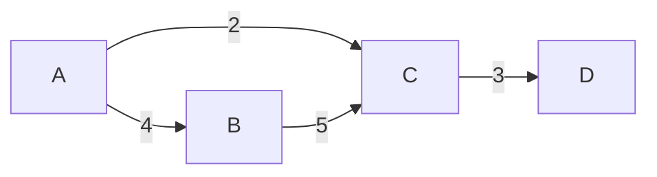

# Быстрый старт

Эта статья — минимальный практический обзор возможностей GraphToolkit.
После её прочтения вы сможете создавать графы и запускать большинство
алгоритмов библиотеки.

## Создание графа

### Вариант 1: напрямую через `Graph<T>`

Самый явный способ — создать граф и добавить рёбра:

```csharp
using GraphToolkit.Core;

var graph = new Graph<string>(isDirected: true);
graph.AddEdge("A", "B", 4);
graph.AddEdge("A", "C", 2);
graph.AddEdge("B", "C", 5);
graph.AddEdge("C", "D", 3);

Console.WriteLine($"Вершин: {graph.VertexCount}, рёбер: {graph.EdgeCount}");
// Вершин: 4, рёбер: 4
```

### Вариант 2: fluent-билдер

Более лаконично для больших графов:

```csharp
using GraphToolkit.Utils;

var graph = new GraphBuilder<string>(isDirected: true)
    .AddEdge("A", "B", 4)
    .AddEdge("A", "C", 2)
    .AddEdge("B", "C", 5)
    .AddEdge("C", "D", 3)
    .Build();
```

### Неориентированный граф

По умолчанию `isDirected: false`:

```csharp
var undirected = new GraphBuilder<int>()
    .AddEdge(1, 2, 1.5)
    .AddEdge(2, 3, 2.5)
    .AddEdge(3, 1, 0.5)
    .Build();
```

### Изолированные вершины

```csharp
var g = new GraphBuilder<string>(isDirected: true)
    .AddVertex("X")              // без рёбер
    .AddEdge("A", "B")
    .Build();

Console.WriteLine(g.VertexCount);   // 3
Console.WriteLine(g.EdgeCount);     // 1
```

---

## Первый алгоритм: Дейкстра

Найдём кратчайший путь в неотрицательно взвешенном графе:

```csharp
using GraphToolkit.ShortestPaths;

var path = Dijkstra.FindPath(graph, "A", "D");
Console.WriteLine(string.Join(" -> ", path!));
// A -> C -> D
```

Хотим все расстояния от стартовой вершины:

```csharp
var (distances, predecessors) = Dijkstra.Compute(graph, "A");

foreach (var (node, d) in distances.OrderBy(kv => kv.Value))
    Console.WriteLine($"{node,-3} {d,3}");
// A     0
// C     2
// B     4
// D     5
```

---

## Обход графа

### BFS — кратчайший по рёбрам

```csharp
using GraphToolkit.Traversal;

var path = Bfs.FindPath(graph, "A", "D");
Console.WriteLine(string.Join(" → ", path!));
// A → C → D
```

### DFS — любой путь

```csharp
var path = Dfs.FindPath(graph, "A", "D");
```

### Топологическая сортировка (только для DAG)

```csharp
var dag = new GraphBuilder<string>(isDirected: true)
    .AddEdge("рубашка", "галстук")
    .AddEdge("галстук", "пиджак")
    .AddEdge("носки", "ботинки")
    .Build();

var order = TopologicalSort.Sort(dag);
Console.WriteLine(string.Join(" → ", order!));
// рубашка → носки → галстук → пиджак → ботинки
```

---

## Минимальное остовное дерево

Только для **неориентированных** графов.

```csharp
using GraphToolkit.MinimumSpanningTree;

var undirected = new GraphBuilder<string>(isDirected: false)
    .AddEdge("A", "B", 1)
    .AddEdge("B", "C", 2)
    .AddEdge("A", "C", 3)
    .AddEdge("C", "D", 4)
    .Build();

foreach (var edge in Kruskal.Compute(undirected))
    Console.WriteLine(edge);
// A -> B (1)
// B -> C (2)
// C -> D (4)
```

Альтернативные алгоритмы: `Prim.Compute(graph, start)`, `Boruvka.Compute(graph)`.

---

## Максимальный поток

Только для ориентированных графов с пропускными способностями.

```csharp
using GraphToolkit.Core;
using GraphToolkit.Flow;

var net = new FlowNetwork<string>();
net.AddEdge("S", "A", 10);
net.AddEdge("S", "B", 10);
net.AddEdge("A", "T", 5);
net.AddEdge("B", "T", 5);
net.AddEdge("A", "B", 3);   // внутреннее ребро

double maxFlow = Dinic.Compute(net, "S", "T");
Console.WriteLine($"Max flow = {maxFlow}");   // Max flow = 10
```

Минимальный разрез:

```csharp
var sourceSide = Dinic.MinCut(net, "S", "T");
Console.WriteLine("Сторона источника: " + string.Join(", ", sourceSide));
```

---

## Компоненты связности

```csharp
using GraphToolkit.Components;

// Неориентированный граф
var groups = ConnectedComponents.Find(undirected);
Console.WriteLine($"Компонент: {groups.Count}");

// Сильно связные компоненты (ориентированный)
var sccs = StronglyConnectedComponents.Find(directedGraph);
foreach (var scc in sccs)
    Console.WriteLine("{" + string.Join(", ", scc) + "}");
```

---

## Паросочетания

### Двудольный граф — Куна

```csharp
using GraphToolkit.Matching;

var left = new[] { "A", "B", "C" };
var neighbors = new Dictionary<string, string[]>
{
    ["A"] = new[] { "X", "Y" },
    ["B"] = new[] { "X" },
    ["C"] = new[] { "Y", "Z" }
};

var matching = Kuhn.Compute(left, u => neighbors[u]);
foreach (var (u, v) in matching)
    Console.WriteLine($"{u} ↔ {v}");
```

### Оптимальное назначение — Венгерский

```csharp
var cost = new double[,]
{
    { 10, 5, 13 },
    { 3, 7, 9 },
    { 6, 8, 4 }
};

var result = HungarianAlgorithm.Solve(cost);
Console.WriteLine($"Минимальная стоимость: {result.TotalCost}");
// Минимальная стоимость: 12
```

---

## Преобразования графа

```csharp
// Клонирование
var copy = graph.Clone();

// Смена направленности
var undirected = directedGraph.ToUndirected();
var directed = undirectedGraph.ToDirected();

// Транспонирование (все рёбра — в обратную сторону)
var transposed = graph.Transpose();
```

---

## Матрица смежности

Для **плотных** графов удобнее матрица — O(1) проверка ребра:

```csharp
using GraphToolkit.Core;

var matrix = new AdjacencyMatrixGraph<string>(isDirected: true);
matrix.AddEdge("A", "B", 4);
matrix.AddEdge("B", "C", 2);

// Все алгоритмы работают без изменений:
var path = Dijkstra.FindPath(matrix, "A", "C");
```

---

## Визуализация

Экспорт в форматы, которые рендерятся в GitHub, GitLab, Notion:

```csharp
using GraphToolkit.Visualization;

// Mermaid — вставляется в markdown
string mermaid = GraphExporters.ToMermaid(graph);
Console.WriteLine(mermaid);
```

Результат:



DOT (GraphViz), матрица, список смежности:

```csharp
string dot    = GraphExporters.ToDot(graph, "MyGraph");
string mat    = GraphExporters.ToAdjacencyMatrix(graph);
string list   = GraphExporters.ToAdjacencyList(graph);
```

---

## Следующие шаги

- [Ключевые концепции](core-concepts.md) — что такое `IGraph<T>`, `Edge<T>`, `T : notnull`
- [Кратчайшие пути](shortest-paths.md) — Дейкстра, Беллман-Форд, A*, Флойд-Уоршелл
- [Потоки в сети](flows.md) — Форд-Фалкерсон, Эдмондс-Карп, Диниц
- [Паросочетания](matching.md) — Куна, Blossom, Венгерский
- [Визуализация](visualization.md) — DOT, Mermaid и другие форматы
- [Производительность](performance.md) — когда какой алгоритм использовать