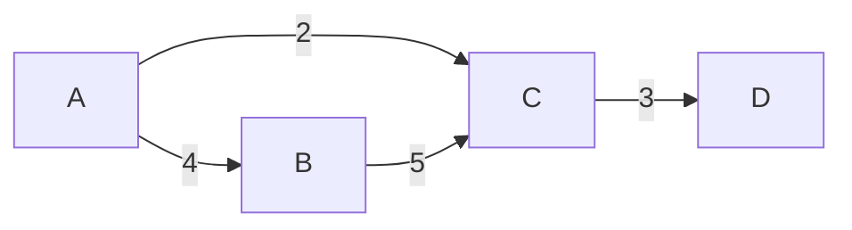

# Быстрый старт

## Создание графа

### Вариант 1: напрямую через `Graph<T>`

```csharp
using GraphToolkit.Core;

var graph = new Graph<string>(isDirected: true);
graph.AddEdge("A", "B", 4);
graph.AddEdge("A", "C", 2);
graph.AddEdge("B", "C", 5);
graph.AddEdge("C", "D", 3);
```

### Вариант 2: fluent-билдер

```csharp
using GraphToolkit.Utils;

var graph = new GraphBuilder<string>(isDirected: true)
    .AddEdge("A", "B", 4)
    .AddEdge("A", "C", 2)
    .AddEdge("B", "C", 5)
    .AddEdge("C", "D", 3)
    .Build();
```

### Неориентированный граф

```csharp
var undirected = new GraphBuilder<int>(isDirected: false)
    .AddEdge(1, 2, 1.5)
    .AddEdge(2, 3, 2.5)
    .Build();
```

## Первый алгоритм: Дейкстра

```csharp
using GraphToolkit.ShortestPaths;

var path = Dijkstra.FindPath(graph, "A", "D");
if (path != null)
    Console.WriteLine(string.Join(" -> ", path));
// A -> C -> D
```

## Первый алгоритм: MST (Краскал)

```csharp
using GraphToolkit.MinimumSpanningTree;

var undirected = new GraphBuilder<string>(isDirected: false)
    .AddEdge("A", "B", 1)
    .AddEdge("B", "C", 2)
    .AddEdge("A", "C", 3)
    .Build();

foreach (var e in Kruskal.Compute(undirected))
    Console.WriteLine(e);
// A -> B (1)
// B -> C (2)
```

## Первый алгоритм: максимальный поток

```csharp
using GraphToolkit.Core;
using GraphToolkit.Flow;

var net = new FlowNetwork<string>();
net.AddEdge("S", "A", 10);
net.AddEdge("S", "B", 10);
net.AddEdge("A", "T", 5);
net.AddEdge("B", "T", 5);

double maxFlow = Dinic.Compute(net, "S", "T");
Console.WriteLine($"Max flow: {maxFlow}"); // 10
```

## Визуализация

```csharp
using GraphToolkit.Visualization;

string mermaid = GraphExporters.ToMermaid(graph);
Console.WriteLine(mermaid);
```

Результат:



## Что дальше

- [Ключевые концепции](core-concepts.md)
- [Кратчайшие пути](shortest-paths.md)
- [Потоки в сети](flows.md)