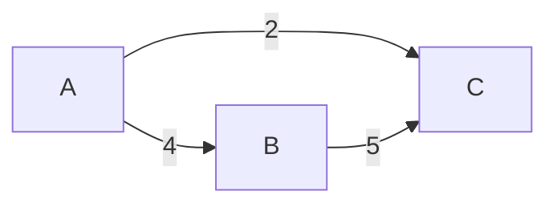

# Визуализация

## Mermaid (для markdown / GitHub / GitLab)

```csharp
using GraphToolkit.Visualization;

string mermaid = GraphExporters.ToMermaid(graph);
Console.WriteLine(mermaid);
```

Результат:



Вставьте в markdown-блок с языком `mermaid` — GitHub, GitLab,
Notion и другие платформы отобразят граф.

---

## GraphViz DOT

```csharp
string dot = GraphExporters.ToDot(graph, "MyGraph");
File.WriteAllText("graph.dot", dot);
```

Затем скомпилируйте в изображение:

```bash
dot -Tpng graph.dot -o graph.png
dot -Tsvg graph.dot -o graph.svg
```

Или вставьте на https://webgraphviz.com / https://dreampuf.github.io/GraphvizOnline.

---

## Матрица смежности

```csharp
string matrix = GraphExporters.ToAdjacencyMatrix(graph);
Console.WriteLine(matrix);
```

Пример:

```
          A     B     C     D
    A     0     4     2     -
    B     -     0     5    10
    C     -     -     0     -
    D     -     -     -     0
```

---

## Список смежности

```csharp
string list = GraphExporters.ToAdjacencyList(graph);
Console.WriteLine(list);
```

Пример:

```
A: B(4), C(2)
B: C(5), D(10)
C:
D:
```

---

## Цвета вершин

Для подсветки вершин в DOT/Mermaid:

```csharp
var colors = new Dictionary<string, string>
{
    ["A"] = "lightgreen",
    ["B"] = "lightcoral",
    ["C"] = "lightyellow"
};

string dot = GraphExporters.ToDot(graph, "Colored", colors: colors);
string mermaid = GraphExporters.ToMermaid(graph, colors: colors);
```

## См. также

- [Быстрый старт](getting-started.md)
- [Ключевые концепции](core-concepts.md)